# Design Document 

Authors:
Gambino Matteo, Valentini Valeria, Gigante Samuele, Basilico Michele

Date:
30/04/2021

Version:
1.0

# Contents

- [High level design](#package-diagram)
- [Low level design](#class-diagram)
- [Verification traceability matrix](#verification-traceability-matrix)
- [Verification sequence diagrams](#verification-sequence-diagrams)

# Instructions

The design must satisfy the Official Requirements document, notably functional and non functional requirements

# High level design 

pattern used:
- MVC
- Layered- 3 tiered

```plantuml
@startuml
 package GUI{}
note left of EZShop: Contains application logic and model
package EZShop{}
package Exceptions{}
EZShop -- Exceptions
GUI -- EZShop
@enduml
```
# Low level design

## Package EZShop

### All classes are persistent
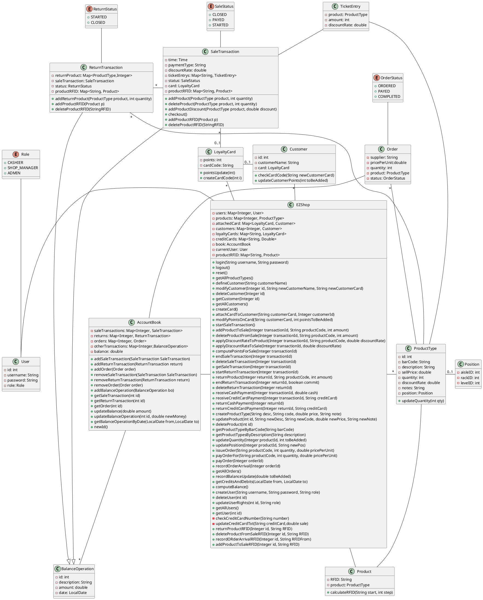
# Verification traceability matrix

| Class| FR1 |FR3 |FR4 |FR5 |FR6 |FR7 |FR8 |
|--|--|--|--|--|--|--|--|
|EZShop                 |X|X|X|X|X|X|X|
|User                   |X| | | | | | | 
|AccountBook            | | |X| | |X|X|
|BalanceOperation       | | |X| |X|X|X|
|Order                  | | |X| | | | |
|SaleTransaction        | | | | |X|X| |
|ProductType            | |X|X| |X| | |
|ReturnTransaction      | | | | |X| | |
|Customer               | | | |X| | | |
|LoyaltyCard            | | | |X| | | |
|Position               | | |X| | | | |


# Verification sequence diagrams 


### Sequence diagram related to scenario 1.1
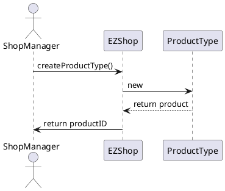

### Sequence diagram related to scenario 2.1
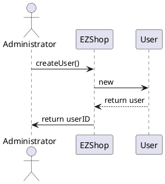
### Sequence diagram related to scenario 3.1
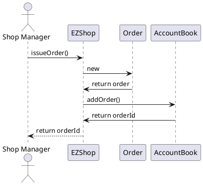

### Sequence diagram related to scenario 5.1
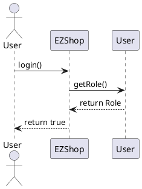


### Sequence diagram related to scenario 6.2
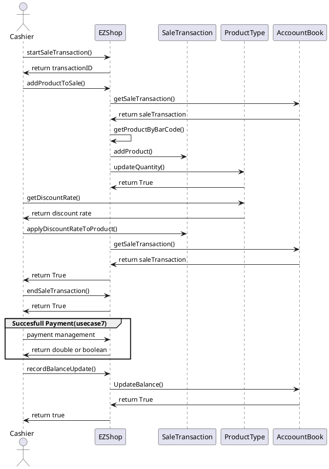
### Sequence diagram related to scenario 6.4
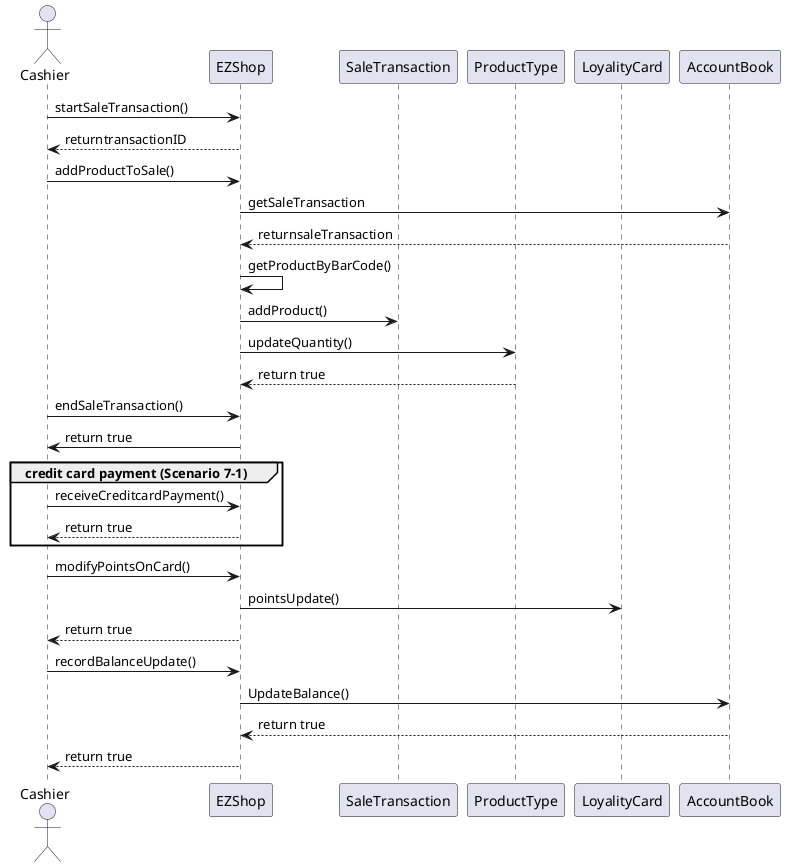

### Sequence diagram related to scenario 6.5
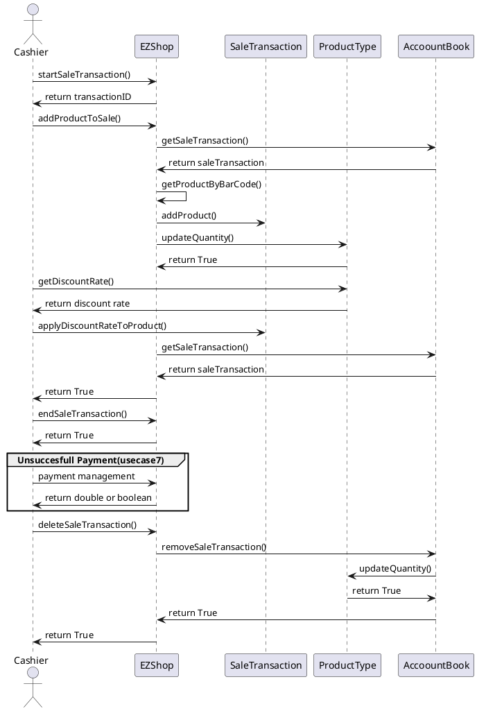


### Sequence diagram related to scenario 7.2
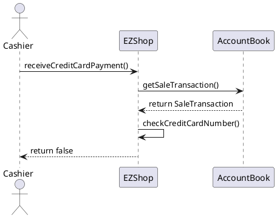

### Sequence diagram related to scenario 8.1
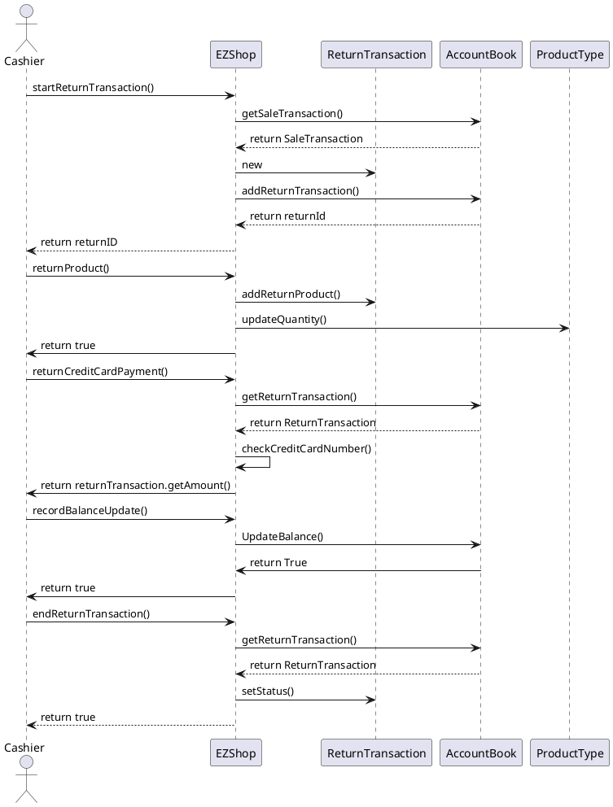

### Sequence diagram related to scenario 9.1
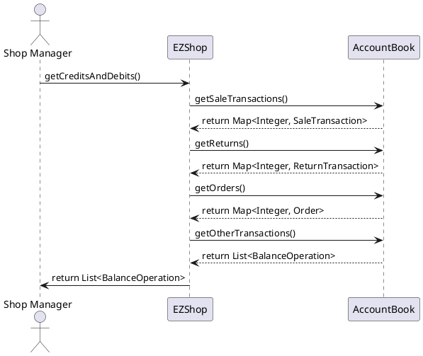
