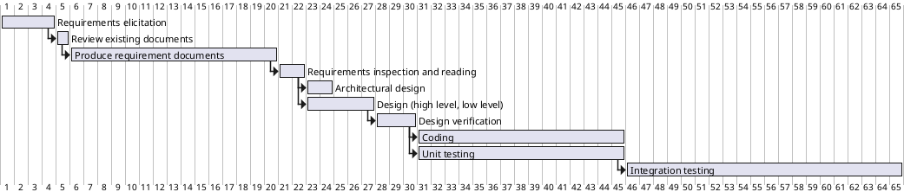

1
2
3
4
5
6
7
8
9
10
11
12
13
14
15
16
17
18
19
20
21
22
23
24
25
26
27
28
29
30
31
32
33
34
35
36
37
38
39
40
41
42
43
44
45
46
47
48
49
50
51
# Project Estimation  
Authors:
Gambino Matteo, Valentini Valeria, Gigante Samuele, Basilico Michele

Date:
30/04/2021

Version:
1.0
# Contents
- [Estimate by product decomposition]
- [Estimate by activity decomposition ]
# Estimation approach

# Estimate by product decomposition
### 
|             | Estimate                        |             
| ----------- | ------------------------------- |  
| NC =  Estimated number of classes to be developed   |            20                 |             
|  A = Estimated average size per class, in LOC       |                150            | 
| S = Estimated size of project, in LOC (= NC * A) | 3000|
| E = Estimated effort, in person hours (here use productivity 10 LOC per person hour)  |               300                       |   
| C = Estimated cost, in euro (here use 1 person hour cost = 30 euro) | 9000| 
| Estimated calendar time, in calendar weeks (Assume team of 4 people, 8 hours per day, 5 days per week ) |           2        |    

In the estimated calendar time we assumed that all people of the team can work in parallel in each phase of the project.
# Estimate by activity decomposition
### 
|         Activity name    | Estimated effort (person hours)   |             
| ----------- | ------------------------------- | 
| Requirements elicitation| 30|
| Review existing documents| 5|
| Produce requirement documents| 120|
| Requirements inspection and reading| 15|
| Architectural design | 10 |
| Design (high level, low level)| 40|
| Design verification| 20|
| Coding| 150|
| Unit testing| 150|
| Integration testing| 200 |
| 
###
Insert here Gantt chart with above activities

