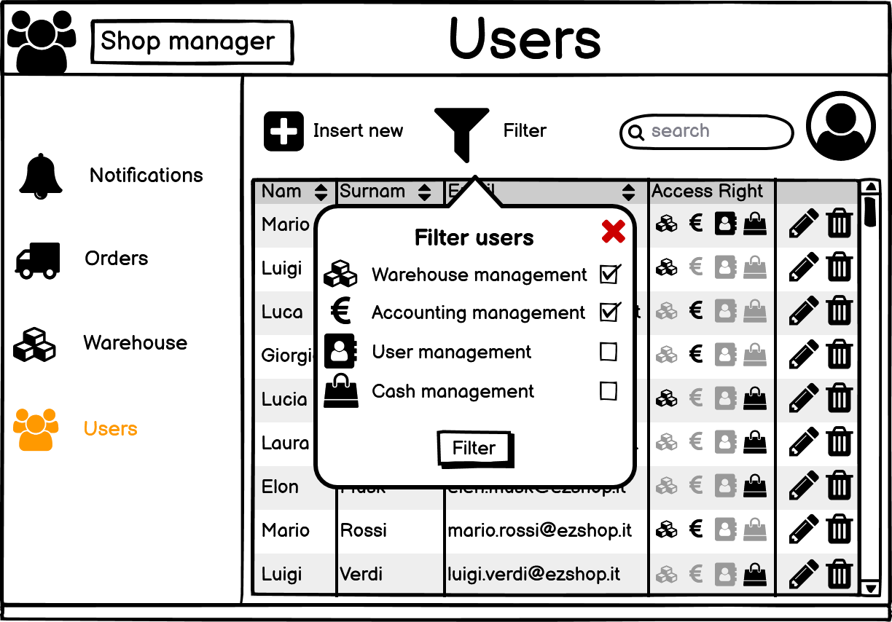
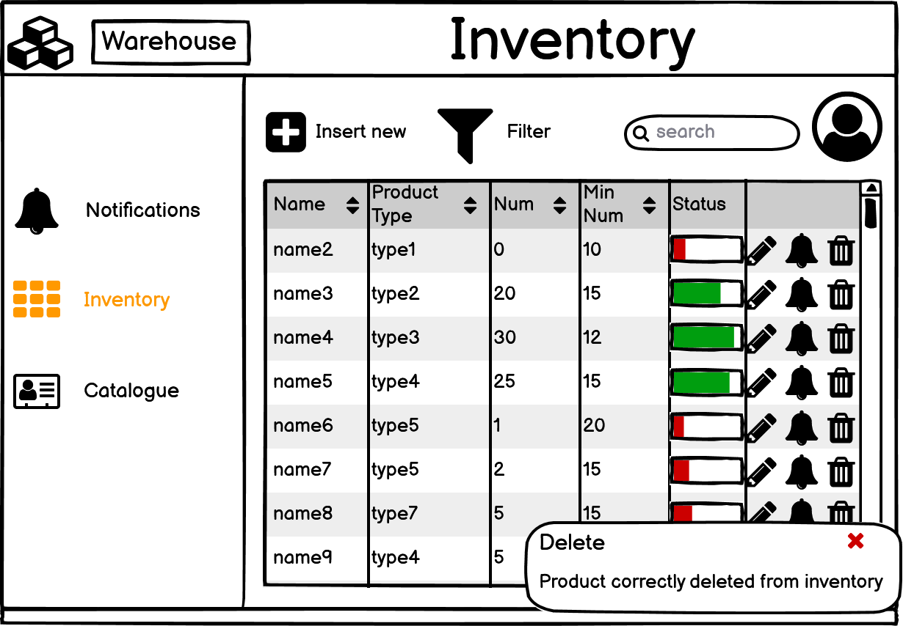

# Graphical User Interface Prototype  

Authors:
Gambino Matteo, Valentini Valeria, Gigante Samuele, Basilico Michele
Date:
21/04/2021
Version:
1.0
# EzShop GUI
## User login

### Login error

### Logout

### Change of user role but user not authorized

# Shop Manager

## Orders section

### Reorder

### Create a new order

## User section

### Insert user

### Filter user

### Edit user

### Delete user

## Suppliers

### Supplier insert

### Supplier edit

### Supplier delete

# Warehouse
## Notifications view 

## Inventory view

### Insert a new product into inventory

### Filter products

### Edit a product

### Notify about inventory level of the product

### Delete a product from inventory

# Catalogue

## Add product to catalogue

## Edit product from catalogue

## Delete product type

## Product type search

# Cash Register
## Home
### Customer without fidelity card

### Customer with fidelity card

## Customer Profile
### Edit, Show, Delete, Search a Customer Profile

### Replace a fidelity card for a customer with lost fidelity card

### Add new Customer

### Error: the Customer Profile already exists

## Checkout
### Cash and fidelity card checkout

### Credit card and no fidelity card checkout

# Accounting management
## Overview

## Invoices

### Create a new invoice

## Revenues

### Change of the graph

## Balances

### Generate new balance but no invoices/revenue are saved in the system

