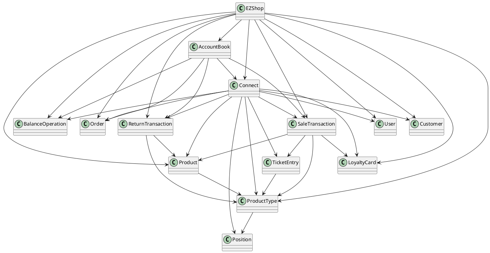

# Integration and API Test Documentation

Authors:

Date:

Version:

# Contents

- [Dependency graph](#dependency graph)

- [Integration approach](#integration)

- [Tests](#tests)

- [Scenarios](#scenarios)

- [Coverage of scenarios and FR](#scenario-coverage)
- [Coverage of non-functional requirements](#nfr-coverage)

# Dependency graph 

     <report the here the dependency graph of the classes in EzShop, using plantuml>

# Integration approach

    <Write here the integration sequence you adopted, in general terms (top down, bottom up, mixed) and as sequence
    (ex: step1: class A, step 2: class A+B, step 3: class A+B+C, etc)> 
    <Some steps may  correspond to unit testing (ex step1 in ex above), presented in other document UnitTestReport.md>
    <One step will  correspond to API testing>
    
## Bottom Up

#  Tests

   <define below a table for each integration step. For each integration step report the group of classes under test, and the names of
     JUnit test cases applied to them> JUnit test classes should be here src/test/java/it/polito/ezshop

## Step 1
| Classes  | JUnit test cases |
|--|--|
| Position | it.polito.ezshop.PositionTest|
| LoyaltyCard| it.polito.ezshop.LoyaltyCardClassTest|
| BalanceOperation| it.polito.ezshop.BalanceOperationTest|
| User | it.polito.ezshop.UserClassTest|
| Customer| it.polito.ezshop.CustomerClassTest|
| Order | it.polito.ezshop.OrderClassTest|

## Step 2
| Classes  | JUnit test cases |
|--|--|
| ProductType| it.polito.ezshop.ProductTypeTest|

## Step 3
| Classes  | JUnit test cases |
|--|--|
| Product| it.polito.ezshop.ProductTest|

## Step 4
| Classes  | JUnit test cases |
|--|--|
| ReturnTransaction | it.polito.ezshop.ReturnTransactionTest|
| TicketEntry | it.polito.ezshop.TicketEntryTest|

## Step 5
| Classes  | JUnit test cases |
|--|--|
| SaleTransaction | it.polito.ezshop.SaleTransactionTest|

## Step 6
| Classes  | JUnit test cases |
|--|--|
| AccountBook| it.polito.ezshop.AccountBookTest|
## Step 7  

| Classes  | JUnit test cases |
|--|--|
|EZShop| it.polito.ezshop.ProductAPITest   it.polito.ezshop.OrderAPITest |

# Scenarios

<If needed, define here additional scenarios for the application. Scenarios should be named
 referring the UC in the OfficialRequirements that they detail>

## Scenario UCx.y

| Scenario |  name |
| ------------- |:-------------:| 
|  Precondition     |  |
|  Post condition     |   |
| Step#        | Description  |
|  1     |  ... |  
|  2     |  ... |

## Scenario UC1-4

| Scenario |  Delete product type |
| ------------- |:-------------:| 
|  Precondition     | Product type X exists |
|         | ShopManager S exists and is logged in|
|  Post condition     |  Product type X not exists |
| Step#        | Description  |
|  1     |  S select X's record |  
|  2     |  S deletes X |
|  3     |  X is deleted from the system|

## Scenario UC1-5

| Scenario |  List all product types |
| ------------- |:-------------:| 
|  Precondition     | ShopManager S exists and is logged in |
|  Post condition     | List of all product types is displayed |
| Step#        | Description  |
|  1     |  S asks for product list |  
|  2     |  system displays the product list |
## Scenario UC1-6

| Scenario |  Get Product type by barcode |
| ------------- |:-------------:| 
|  Precondition     | ShopManager S exists and is logged in |
|         | Product type X exists|
|  Post condition     | X information are shown |
| Step#        | Description  |
|  1     |  S enters X barcode |  
|  2     |  system searches for X |
|  3     |  System displays X information|
## Scenario UC1-7

| Scenario |  Get product types by description |
| ------------- |:-------------:| 
|  Precondition     | ShopManager S exists and is logged in |
|  Post condition     | List of products that matches entered description is shown  |
| Step#        | Description  |
|  1     |  S fills description |  
|  2     |  System searches for product that matches description |
|  3     |  System displays list of retrieved products|
## Scenario UC3-4

| Scenario |  Issue & Pay order |
| ------------- |:-------------:| 
|  Precondition     | ShopManager S exists and is logged in |
|         | Product type X exists|
|         | Order O not exists |
|         | Balance >= Order.units * Order.pricePerUnit |
|  Post condition     |  Order O is in PAYED state |
|         | Balance -= Order.units * Order.pricePerUnit|
|         | X.units not changed|
| Step#        | Description  |
|  1     |  S creates Order O|  
|  2     |  S fills quantity of product to  be ordered and the price per unit|
|  3     | S register payment done for O|
|  4     | O's state is set to PAYED|
|  5     | O is inserted into the system|

## Scenario UC3-5

| Scenario |  List all orders |
| ------------- |:-------------:| 
|  Precondition     | ShopManager S exists and is logged in |
|  Post condition     | Order list is shown |
| Step#        | Description  |
|  1     |  S asks for order list |  
|  2     |  the system displays Order list |
## Scenario UC4-5

| Scenario |  List all customers|
| ------------- |:-------------:| 
|  Precondition     | Cashier C exists and is logged in |
|  Post condition     | List of all customers is displayed |
| Step#        | Description  |
|  1     |  C asks for customers' list |  
|  2     |  system displays the customers' list |

## Scenario UC4-6

| Scenario | Delete a customer|
| ------------- |:-------------:| 
|  Precondition     |Customer is registered in the system |
|         | Cashier C exists and is logged in|
|  Post condition     |  Customer profile is deleted from the system |
| Step#        | Description  |
|  1     |  C select customer's profile |  
|  2     |  C deletes customer's profile|
|  3     |  customer's profile is deleted from the system|

## Scenario UC4-7

| Scenario |  Search a customer |
| ------------- |:-------------:| 
|  Precondition     | ShopManager S exists and is logged in |
|         | Customer is registered in the system|
|  Post condition     | Customer information are shown |
| Step#        | Description  |
|  1     |  S enters Customers's name |  
|  2     |  System searches for the Customer's profile |
|  3     |  System displays Customer's information|

## Scenario UC4-8
| Scenario |  Modify points on card |
| ------------- |:-------------:| 
|  Precondition     | Cashier C     exists and is logged in |
|         | Customer is registered in the system|
|        |Customer has a fidelity card code attached |
|  Post condition     | Customer's fidelity card is updated  |
| Step#        | Description  |
|  1     |  C enters Customers's name |  
|  2     |  System searches for the Customer's profile |
|  3     |  System displays Customer's information|
|  4     |  C updates Customer's points |
|  5     |  System saves the changes |
## Scenario UC4-9

| Scenario |  Create a Card |
| ------------- |:-------------:| 
|  Precondition     | ShopManager S exists and is logged in |
|         |Card is not defined in the system|
|  Post condition     |A new card is defined|
| Step#        | Description  |
|  1     |  S enters Customers's name |  
|  2     |  System searches for the Customer's profile |
|  3     |  System displays Customer's information|
| 4      |  S generates a new card code|
| 5 | System attaches card to selected Customer| 

## Scenario UC2-4
| Scenario |  Search a User |
| ------------- |:-------------:| 
|  Precondition     | ShopManager S exists and is logged in |
|         | User is registered in the system|
|  Post condition     | User's information are shown |
| Step#        | Description  |
|  1     |  S enters User's name |  
|  2     |  System searches for the Users's profile |
|  3     |  System displays Users's information|

## Scenario UC2-5

| Scenario |  View all users|
| ------------- |:-------------:| 
|  Precondition     | Administrator A exists and is logged in |
|  Post condition     | List of all users is displayed |
| Step#        | Description  |
|  1     |  A asks for users' list |  
|  2     |  system displays the users' list |

## Scenario UC6-6

| Scenario |  Delete product from sale |
| ------------- |:-------------:| 
|  Precondition     |  Cashier C exists and is logged in|
| |Product type X exists and has enough units to complete the sale|
| | Product type X exists inside the sale|
| | Quantity of X to delete Q < X.qty|
|  Post condition     | X.qty = X.qty - Q  |
| | total is updated|
| Step#        | Description  |
|  1     |  C reads barcode of X |  
|  2     |  C deletes Q units of X from sale |
| 3      |  System updates quantity of X in transaction|
|4 | system updates total of transaction|
## Scenario UC7-5
| Scenario |  Manage payment with a card not registered in the system|
| ------------- |:-------------:| 
|  Precondition     | Administrator A,Cashier C or ShopManager SM exists and is logged in |
|                   |  Credit card C not registered in the system   |
|  Post condition     | C.Balance does not change |
| Step#        | Description  |
|  1     |  Read C.number |  
|  2     |  Validate C.number with Luhn algorithm   |
|  3     |  C.number is valid, check on the system if credit card is registered   |
|  4     |  C.number is not yet registered in the system, issue warning |
|   5   |   Exit with error|

## Scenario UC7-6
| Scenario |  Manage cash payment with not enough money|
| ------------- |:-------------:| 
|  Precondition     | Administrator A,Cashier C or ShopManager SM exists and is logged in |
|                   | C.Balance < Price   |
|  Post condition     | C.Balance does not change |
| Step#        | Description  |
|  1     |  Compute cash quantity |  
|  2     |  Collect banknotes and coin   |
|  3     |  Cash is not enough   |
|  4     |  Sale is stopped, issue warning |
|  5     |   Exit with error|

## Scenario UC8-3
| Scenario |  Return transaction of product type X not completed, cash|
| ------------- |:-------------:| 
|  Precondition     | Administrator A or ShopManager SM exists and is logged in |
|                   | Product Type X exists   |
|                   | Ticket transaction T exists and has at least N units of X |
|                   | Transaction T was paid cash |
|                   | Transaction T is not finished |
|  Post condition     | C.Balance does not change |
|                   | The quantity of the product available in the shop does not change |
|                   | No money is returned to the customer with cash|
| Step#        | Description  |
|  1    |  C inserts T.transactionId |
|  2    |  Return transaction starts |  
|  3    |  C reads bar code of X |
|  4    |  X cannot be brought back|
|  5    |  C stops the return transaction and closes it  |
|  6    |  Exit with error |

## Scenario UC8-4
| Scenario |  Return transaction of product type X not completed, credit card|
| ------------- |:-------------:| 
|  Precondition     | Administrator A or ShopManager SM exists and is logged in |
|                   | Product Type X exists   |
|                   | Ticket transaction T exists and has at least N units of X |
|                   | Transaction T was paid with credit card |
|                   | Transaction T is not finished |
|  Post condition     | C.Balance does not change |
|                   | The quantity of the product available in the shop does not change |
|                   | No money is returned to the customer on the credit card|
| Step#        | Description  |
|  1    |  C inserts T.transactionId |
|  2    |  Return transaction starts |  
|  3    |  C reads bar code of X |
|  4    |  X cannot be brought back |
|  5    |  C stops the return transaction and closes it  |
|  6    |  Exit with error |

## Scenario UC9-2
| Scenario |  Record debit  |
| ------------- |:-------------:| 
|  Precondition     | Administrator A or ShopManager SM exists and is logged in |
|                   | The transaction T exists and has ended  |
|                   | T is an order transaction |
|  Post condition     | C.Balance is updated |
|                   | Transaction T is set as "DEBIT" |
| Step#        | Description  |
|  1    |  SM inserts T.transactionId |
|  2    |  SM checks if T is a DEBIT or CREDIT |  
|  3    |  SM set the transaction as "DEBIT" |
|  4    |  New balance update is requested to the system |
|  5    |  Balance is updated |

## Scenario UC9-3
| Scenario |  Record credit  |
| ------------- |:-------------:| 
|  Precondition     | Administrator A or ShopManager SM exists and is logged in |
|                   | The transaction T exists and has ended  |
|                   | T is a sale transaction |
|  Post condition     | C.Balance is updated |
|                   | Transaction T is set as "CREDIT" |
| Step#        | Description  |
|  1    |  SM inserts T.transactionId |
|  2    |  SM checks if T is a DEBIT or CREDIT |  
|  3    |  SM set the transaction as "CREDIT" |
|  4    |  New balance update is requested to the system |
|  5    |  Balance is updated |

## Scenario UC9-4
| Scenario |  Compute balance |
| ------------- |:-------------:| 
|  Precondition     | Administrator A or ShopManager SM exists and is logged in |
|  Post condition     | C.Balance= OldBalance + NewAmount |
|                   | Balance>=0 |
| Step#        | Description  |
|  1    |  New amount is entered into the system |
|  2    |  New balance is generated |  
|  3    |  Balance is updated |

# Coverage of Scenarios and FR

<Report in the following table the coverage of  scenarios (from official requirements and from above) vs FR. 
Report also for each of the scenarios the (one or more) API JUnit tests that cover it. >

| Scenario ID | Functional Requirements covered | JUnit  Test(s) | 
| ----------- | ------------------------------- | ----------- |
|  2-1          |FR1.1  |  it.polito.ezshop.UserAPITest.testCreateUser            |              
|  2-2          |FR1.2  |  it.polito.ezshop.UserAPITest.testDeleteUser            |               
|  2-5          |FR1.3  |  it.polito.ezshop.UserAPITest.testGetAllUsers           |              
|  2-4          |FR1.4  |  it.polito.ezshop.UserAPITest.testGetUser     |             
|  2-3          |FR1.1 |  it.polito.ezshop.UserAPITest.testUpdateUserRights  
| 5-1          | FR1.5 | it.polito.ezshop.UserApiTest.testLogin|
|  1-1         | FR3.1   | it.polito.ezshop.ProductAPITest.testCreateProductType|
|  1-2         | FR4.2   | it.polito.ezshop.ProductAPITest.testUpdateLocation|
|  1-3         | FR3.1   | it.polito.ezshop.ProductAPITest.testUpdateProduct|          
|  1-4         | FR3.2   | it.polito.ezshop.ProductAPITest.testDeleteProductType|
|  1-5         | FR3.3   | it.polito.ezshop.ProductAPITest.testGetAllProductTypes|
|  1-6         | FR3.4   | it.polito.ezshop.ProductAPITest.testGetProductTypeByBarcode |
|  1-7         | FR3.4   | it.polito.ezshop.ProductAPITest.testGetProductTypeByDescription|
|  3-1         | FR4.3   | it.polito.ezshop.OrderAPITest.testIssueOrder |
|  3-4         | FR4.4   | it.polito.ezshop.OrderAPITest.testPayOrderFor |
|  3-3         | FR4.6   | it.polito.ezshop.OrderAPITest.testRecordOrderArrival |
|  3-2         | FR4.5 | it.polito.ezshop.OrderAPITest.testPayOrder|
|  3-5         | FR4.7 | it.polito.ezshop.OrderAPITest.testGetAllOrders|
|  4-1         |FR5.1  |  it.polito.ezshop.CustomerAPITest.testDefineCustomer    |             
|  4-6          |FR5.2  |  it.polito.ezshop.CustomerAPITest.testDeleteCustomer    |           
|  4-4          |FR5.3  |  it.polito.ezshop.CustomerAPITest.testGetCustomer       |         
|  4-5         |FR5.4 |  it.polito.ezshop.CustomerAPITest.testGetAllCustomers   |         
|  4-9         |FR5.5  |  it.polito.ezshop.LoyaltyCardAPITest.testCreateCard    |          
|  4-2          |FR5.6  |  it.polito.ezshop.LoyaltyCardAPITest.testAttachCardToCustomer    |              
|  4-8         |FR5.7  |  it.polito.ezshop.LoyaltyCardAPITest.testModifyPointsOnCard   |              
|  6-1, 6-6   | FR6.1  | it.polito.ezshop.SaleTransactionAPITest.testStartSaleTransaction |
|             | FR6.2, FR6.7 | it.polito.ezshop.SaleTransactionAPITest.testAddProductToSale | 
|             | FR6.8, FR6.9 | it.polito.ezshop.SaleTransactionAPITest.testCheckout |
|             | FR6.10, FR6.11  | it.polito.ezshop.SaleTransactionAPITest.testEndSaleTransaction |
|  6-2        | FR6.1  | it.polito.ezshop.SaleTransactionAPITest.testStartSaleTransaction |
|             | FR6.2, FR6.7 | it.polito.ezshop.SaleTransactionAPITest.testAddProductToSale | 
|             | FR6.5 | it.polito.ezshop.SaleTransactionAPITest.testApplyDiscountRateToProduct | 
|             | FR6.8, FR6.9 | it.polito.ezshop.SaleTransactionAPITest.testCheckout |
|             | FR6.10, FR6.11  | it.polito.ezshop.SaleTransactionAPITest.testEndSaleTransaction |
|  6-3        | FR6.1  | it.polito.ezshop.SaleTransactionAPITest.testStartSaleTransaction |
|             | FR6.2, FR6.7 | it.polito.ezshop.SaleTransactionAPITest.testAddProductToSale | 
|             | FR6.4 | it.polito.ezshop.SaleTransactionAPITest.testApplyDiscountRateToSale | 
|             | FR6.8, FR6.9 | it.polito.ezshop.SaleTransactionAPITest.testCheckout |
|             | FR6.10, FR6.11  | it.polito.ezshop.SaleTransactionAPITest.testEndSaleTransaction |
|  6-4        | FR6.1  | it.polito.ezshop.SaleTransactionAPITest.testStartSaleTransaction |
|             | FR6.2, FR6.7 | it.polito.ezshop.SaleTransactionAPITest.testAddProductToSale | 
|             | FR6.6 | it.polito.ezshop.SaleTransactionAPITest.testComputePointsForSale | 
|             | FR6.8, FR6.9 | it.polito.ezshop.SaleTransactionAPITest.testCheckout |
|             | FR6.10, FR6.11  | it.polito.ezshop.SaleTransactionAPITest.testEndSaleTransaction |
|  6-5        | FR6.1  | it.polito.ezshop.SaleTransactionAPITest.testStartSaleTransaction |
|             | FR6.2, FR6.7 | it.polito.ezshop.SaleTransactionAPITest.testAddProductToSale |
|             | FR6.8, FR6.9 | it.polito.ezshop.SaleTransactionAPITest.testCheckout |
|             | FR6.10  | it.polito.ezshop.SaleTransactionAPITest.testEndSaleTransaction |
|             | FR6.11 | it.polito.ezshop.SaleTransactionAPITest.testDeleteSaleTransaction |
| 6-6         | FR6.3| polito.ezshop.SaleTransactionAPITest.testDeleteProductFromSale|
|  7-1        |FR7.2  |  it.polito.ezshop.PaymentAPITest.testReceiveCreditCardPayment            |             
|  7-2        |FR7.2  |  it.polito.ezshop.PaymentAPITest.testReceiveCreditCardPayment           |          
|  7-3        |FR7.2  |  it.polito.ezshop.PaymentAPITest.testReceiveCreditCardPayment            |             
|  7-4        |FR7.1  |  it.polito.ezshop.PaymentAPITest.testReceiveCashPayment           |          
|  7-5        |FR7.2  |  it.polito.ezshop.PaymentAPITest.testReceiveCreditCardPayment            |             
|  7-6        |FR7.1  |  it.polito.ezshop.PaymentAPITest.testReceiveCashPayment           |           
|  8-1        | FR6.12  |  it.polito.ezshop.ReturnTransactionAPITest.testStartReturnTransaction |
|             | FR6.13 | it.polito.ezshop.ReturnTransactionAPITest.testReturnProduct |
|             | FR6.14, FR6.15 | it.polito.ezshop.ReturnTransactionAPITest.testEndReturnTransaction |
|  8-2        | FR6.12  |  it.polito.ezshop.ReturnTransactionAPITest.testStartReturnTransaction |
|             | FR6.13 | it.polito.ezshop.ReturnTransactionAPITest.testReturnProduct |
|             | FR6.14, FR6.15 | it.polito.ezshop.ReturnTransactionAPITest.testEndReturnTransaction |
|  8-3        | FR6.12  |  it.polito.ezshop.ReturnTransactionAPITest.testStartReturnTransaction |
|             | FR6.13 | it.polito.ezshop.ReturnTransactionAPITest.testReturnProduct |
|             | FR6.14, FR6.15 | it.polito.ezshop.ReturnTransactionAPITest.testEndReturnTransaction |
|             | FR7.3  |  it.polito.ezshop.PaymentAPITest.testReturnCashPayment |   
|  8-4        | FR6.12  |  it.polito.ezshop.ReturnTransactionAPITest.testStartReturnTransaction |
|             | FR6.13 | it.polito.ezshop.ReturnTransactionAPITest.testReturnProduct |
|             | FR6.14, FR6.15 | it.polito.ezshop.ReturnTransactionAPITest.testEndReturnTransaction |          
|             |FR7.4  |  it.polito.ezshop.PaymentAPITest.testReturnCreditCardPayment  | 
|  9-1        |FR8.3 |  it.polito.ezshop.BalanceAPITest.testGetCreditsAndDebits             |   
|  9-2        |FR8.1 |  it.polito.ezshop.BalanceAPITest.testRecordBalanceUpdate             |   
|  9-3        |FR8.2 |  it.polito.ezshop.BalanceAPITest.testRecordBalanceUpdate             |   
|  9-4        |FR8.4 |  it.polito.ezshop.BalanceAPITest.testRecordBalanceUpdate             |               

# Coverage of Non Functional Requirements

<Report in the following table the coverage of the Non Functional Requirements of the application - only those that can be tested with automated testing frameworks.>

### 

| Non Functional Requirement | Test name |
| -------------------------- | --------- |
|           NFR2             | it.polito.ezshop.responseTime.ResponseTimeTest |
|           NFR4             |  it.polito.ezshop.ProductTypeTest.testValidateBarCode         |
|           NFR5             |  it.polito.ezshop.CheckCreditCardTest.testCheckCreditCardNumber|
|           NFR6             | it.polito.ezshop.LoyaltyCard.testCheckCreditCardCode |

