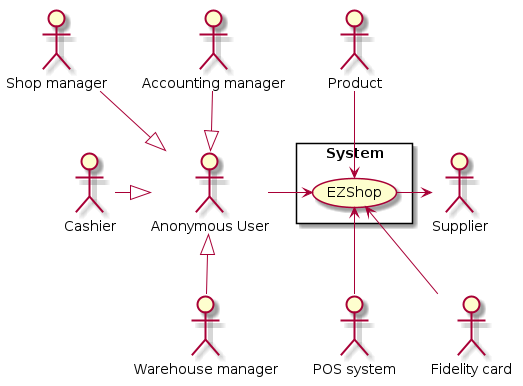
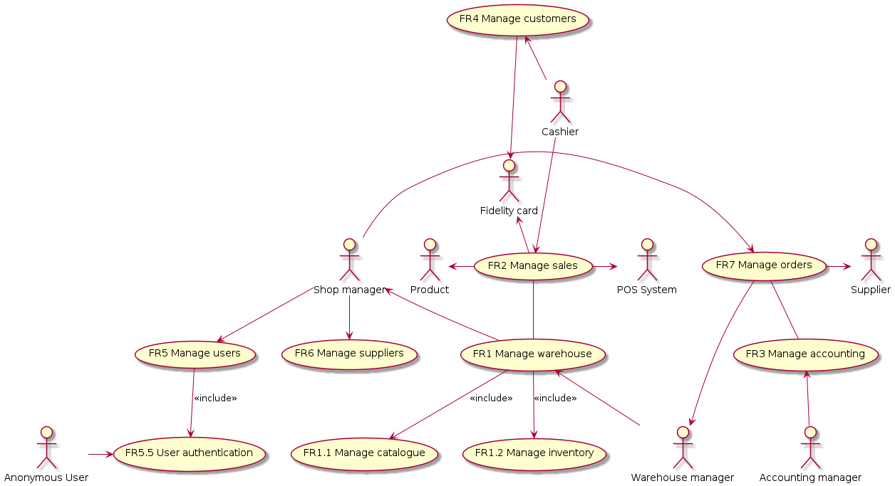
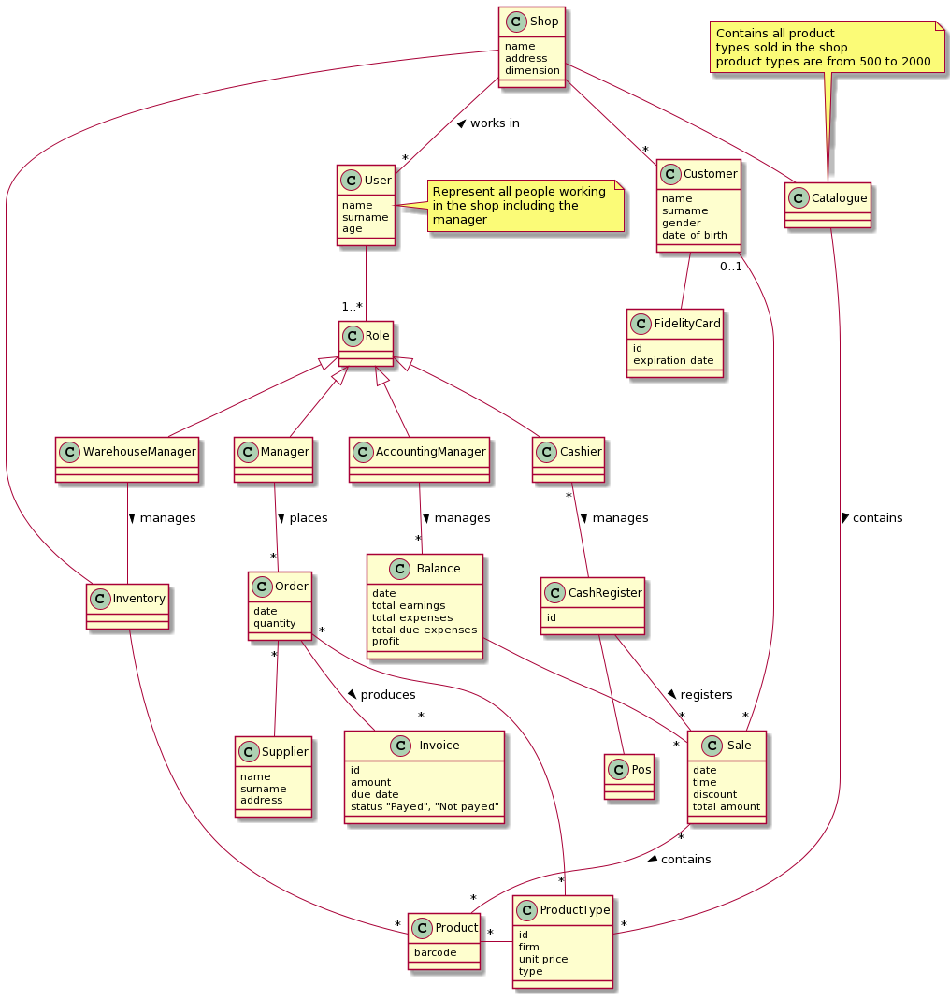
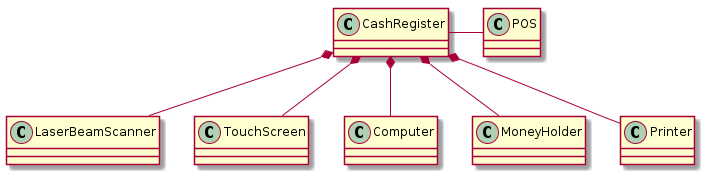
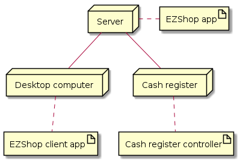

# Requirements Document 

Authors:
Gambino Matteo, Valentini Valeria, Gigante Samuele, Basilico Michele

Date:
21/04/2021

Version:
1.0

# Contents

- [Essential description](#essential-description)
- [Stakeholders](#stakeholders)
- [Context Diagram and interfaces](#context-diagram-and-interfaces)
	+ [Context Diagram](#context-diagram)
	+ [Interfaces](#interfaces) 
	
- [Stories and personas](#stories-and-personas)
- [Functional and non functional requirements](#functional-and-non-functional-requirements)
	+ [Functional Requirements](#functional-requirements)
	+ [Non functional requirements](#non-functional-requirements)
- [Use case diagram and use cases](#use-case-diagram-and-use-cases)
	+ [Use case diagram](#use-case-diagram)
	+ [Use cases](#use-cases)
    	+ [Relevant scenarios](#relevant-scenarios)
- [Glossary](#glossary)
- [System design](#system-design)
- [Deployment diagram](#deployment-diagram)

# Essential description

Small shops require a simple application to support the owner or manager. A small shop (ex a food shop) occupies 50-200 square meters, sells 500-2000 different item types, has one or a few cash registers.

EZShop is a software application that handles the following operations:
* manage sales
* manage inventory
* manage customers
* support accounting

# Stakeholders

| Stakeholder name  | Description | 
| ----------------- |:-----------:|
|   Shop manager   	| Manages the orders to be sent to the suppliers. Manages users and their rights in the system. He can also access all the other functions of the system in order to oversee the work made by his employees  | 
|	Cashier			| Uses the cash register, registers sales and manages the creation of new fidelity cards		|
|	Accounting manager		| Manages balance, invoices and revenues of the shop		|
|	Warehouse manager| Manages the shop's warehouse, including inventory and catalogue |
|	Customer		| Customers of the shop who make sales to purchase products with either cash or credit card|
|	Developer		| Develops the EZShop application and takes care of the maintenance of the application					|
| 	Cash register	| Instrument that registers each sale happened in the shop, contains cash received from sales and prints the sale ticket	|
|	Product			| Product that is sold in the shop and is contained in the inventory and catalogue|
|	Inventory		| List of available physical products in the shop|
|	Catalogue		|  List of all the products types (and their features) available in the shop|
|	Supplier		| Supplies the required products to the shop |
|	POS system		| System that manages credit card payments made by customers|
|	Anonymous User			| Person that will use the EZShop application, who has one or many roles in the shop |
|	Fidelity card	| Card given to a customer in order to receive some discounts |
 

# Context Diagram and interfaces

## Context Diagram
<!--

	@startuml context_diagram
		' system
		rectangle System{
		usecase EZShop
		}
		' actors
		actor :Shop manager: as sm
		actor :Cashier: as cr
		actor :Accounting manager: as am
		actor :Warehouse manager: as wm
		' variant with single end user which has roles
		actor :Anonymous User: as u
		sm --|> u
		cr -|> u
		am --|> u
		u <|-- wm

		actor :Supplier: as s
		actor :POS system: as ccs
		' associations
		''' sm -> EZShop
		''' cr --\> EZShop
		''' am --\> EZShop
		''' wm --\> EZShop		
		' variant with only end user
		u -> EZShop

		s <- EZShop
		EZShop <-- ccs
		EZShop <-- :Fidelity card:
		''' ' If we choose Cash Register and laser beam external
		''' :Cash Register: --\> EZShop
		''' :Laser beam scanner: -- EZShop
		' If cash register and laser beam scanner are internal
		Product --\> EZShop
	@enduml

-->
 

 

## Interfaces

| Actor | Logical Interface | Physical Interface  |
| ------------- |:-------------:| -----:|
|	Supplier		| Purchase order file	| Email on the network containing as attachment the order	|
|	POS system| ECR interface described at <a href="https://www.ccv.eu/wp-content/uploads/2018/05/zvt_ecr_interface_specification.pdf" >ECR</a>| Wired connection|
|	Fidelity card	| Barcode	| Laser beam scanner|
|	Shop Manager, Accounting Manager, Warehouse Manager, Anonymous User			| GUI		| Screen, keyboard, mouse	|
|	Cashier			| GUI 		| Screen, keyboard, cash register	|
<!-- If lase beam scanner and cash register are internal-->
<!-- |Product| Barcode| Laser beam scanner|-->
<!-- If cash register and laser beam scanner are external-->
<!-- 
	|Cash register| | Cable serial communication|
	|Laser beam scanner| | Cable serial communication|
	 -->
 

# Stories and personas

The following personas and stories represent possible actors profiles.
 
 
Matteo is 40, he owns and manages a small food shop. He has to check the inventory every day to place orders to the suppliers for his shop. He is always in a hurry so he wants to spend as little time as possible doing management stuff so he can concentrate more on his customers.
 
 
Laura is 60, she has always worked in the shop of her parents and now she owns it. She is not very familiar with technology but she needs something to better manage the inventory of her shop. She has two nephews and she wants to spend as much time as possible with them so she employed a cashier for her shop that manages the sales and helps her.
 
 
Luca is 25, he works as a cashier in a small shop. During his work, he has to help the shop manager in updating the inventory level of the product sold in the shop. This requires him to stay in the shop after the closing hour to check the inventory. He would really like to spend this time with his friends so he wants that the inventory management is as fast as possible.
 
 
Giorgia is 50, she works as a supplier for many small shops in Turin. Since she is very forgetful, she always checks her emails to see the incoming orders made by the managers of all the different shops she works for.
 
 
Giovanni is 45, he helps the manager of a small food shop in managing the accounting of the shop. He has a daughter and he would like to spend most of his time with her. The manager of the shop he works for requires daily, weekly and monthly reports about the entries and the invoices of the shop. That requires a lot of time and he would like to do that faster in order to have more free time.
 

# Functional and non functional requirements

## Functional Requirements

| ID        | Description  |
| ------------- |:-------------:|
| FR1	| Manage Warehouse |
| FR1.1 | Manage Inventory|
| FR1.1.1	| Show inventory level for a product type|
| FR1.1.2	| Show inventory level for each product type|
| FR1.1.3	| Update inventory level for a product type (increment or decrement products quantity) |
| FR1.1.4	| Notify shop manager for an unavailable product|
| FR1.1.5	| Filter product by type and quantity|
| FR1.2	| Manage Catalogue|
| FR1.2.1 | Add a new product type|
| FR1.2.2	| Remove a product type|
| FR1.2.3	| Update product type information|
| FR1.2.4	| List all product types|
| FR1.2.5	| Search a product type|
| FR1.2.6	| Filter product by type and quantity|
| FR2	| Manage sales|
| FR2.1	| Register into system a sale for a product|
| FR2.2	| Remove a previous sale|
| FR2.3	| Manage payment with credit card|
| FR2.4	| Compute sale ticket|
| FR2.5	| Manage payment for customer with fidelity card (discount ecc.)	|
| FR3	| Manage accounting|
| FR3.1	| Add a new invoice|
| FR3.2	| See all invoices|
| FR3.3	| Search an invoice|
| FR3.4	| Set a invoice as payed|
| FR3.5	| Add a new earning|
| FR3.6	| Get current balance|
| FR3.7	| Generate report with balance, invoices and entries|
| FR4	| Manage customers|
| FR4.1	| Add customer associated with a fidelity card|
| FR4.2	| See all customers|
| FR4.3	| Remove a customer|
| FR4.4	| Search a customer|
| FR4.5	| Update fidelity card |
| FR4.6 | Replace a fidelity card |
| FR5	| Manage users|
| FR5.1	| Add a new user|
| FR5.2	| Remove a user|
| FR5.3	| View all users|
| FR5.4	| Manage access rights for a user|
| FR5.5	| User authentication|
| FR5.6	| Filter users by name,surname,email and rights|
| FR6	| Manage suppliers|
| FR6.1	| Add a new supplier|
| FR6.2	| Update a supplier|
| FR6.3	| Remove a supplier|
| FR6.4	| List all suppliers|
| FR6.5	| Search a supplier|
| FR7	| Manage orders|
| FR7.1	| Place an order to supplier for a given product type|
| FR7.2	| Repeat a previous order to a supplier|
| FR7.3	| Abort a previously inserted order|
| FR7.4	| Search an order|

 

### Access rights, functional requirements and actor 
The following table indicates which actor have the rights to perform functional requirements and the corresponding sub-requirements associated with them described above.
 
|Function| Shop Manager| Cashier | Accounting Manager| Warehouse Manager| Anonymous User |
|---|:---:|:---:|:---:|:---:|:---:|
| FR1 | yes | no	| no | yes|no|
| FR1.1.3	| yes | yes	| no | yes|no|
| FR2 | yes | yes	| no | no |no|
| FR3 | yes | no	| yes | no |no|
| FR3.5 | yes | yes	| no | no |no|
| FR4 | yes | yes	| no | no |no|
| FR5 | yes | no	| no | no |no|
| FR5.5 | no | no	| no | no |yes|
| FR6 | yes | no	| no | no |no|
| FR7 | yes | no	| no | no |no|
| FR7.4 | yes | no	| no | yes |no|

 

## Non Functional Requirements

| ID        | Type (efficiency, reliability, ..)           | Description  | Refers to |
| ------------- |:-------------:| :-----:| -----:|
|  NFR1 | efficiency  	| Time to show the whole inventory < 500ms  | FR1.4|
|  NFR2 | correctness 	| Maximum number of different product types = 2000  | FR2|
|  NFR3 | efficiency 	| More sales can be registered at the same time by different cash registers| FR3.1|
|  NFR4	| efficiency	| Show all the customers in < 500ms | FR5.2 |
|  NFR5	| efficiency	| User authentication procedure time < 500ms| FR6.5|
|  NFR6	| usability		| No specific training should be needed to use the software| All FR|
|  NFR7	| portability	| Software should be available on any OS (Windows, Unix/Linux, MacOs)| All FR|
|  NFR8	| localization	| Currency is EURO | all FR|
|  NFR9| security		| All the users should access only the functions that are allowed by their access rights| all FR|
|  NFR10| security		| Treat user data according to GDPR| |

 

# Use case diagram and use cases

## Use case diagram
<!--

	@startuml usecase_diagram
		' use cases
		usecase "FR1 Manage warehouse" as mi
		usecase "FR1.1 Manage catalogue" as mic
		usecase "FR1.2 Manage inventory" as mii
		usecase "FR2 Manage sales" as ms
		usecase "FR3 Manage accounting" as ma
		usecase "FR4 Manage customers" as mc
		usecase "FR5 Manage users" as mu
		usecase "FR6 Manage suppliers" as msu
		usecase "FR7 Manage orders" as mo
		usecase "FR5.5 User authentication" as mua	

		' actors
		actor :Supplier: as s
		actor :POS System: as ccs
		actor :Fidelity card: as fc	

		actor :Shop manager: as sm
		actor :Cashier: as cr
		actor :Accounting manager: as am
		actor :Warehouse manager: as wm
		'variant with only the end user
		actor :Anonymous User: as u
		'u --\> mi
		'u --\> mca
		'u --\> ms
		'u --\> ma
		'u --\> mc
		'u --\> mu
		'u --\> msu
		'u --\> mo
		u -> mua

		' associations
		mu --\> mua: <<include>>
		ms -- mi
		mo -- ma
		''' shop manager 
		 sm --\> mu
		 ' sm --\> ma
		  sm <-- mi
		 ' sm --\> mc
		 ' sm --\> ms
		 sm --\> msu
		 sm -> mo
		 ' sm --\> mca
		 ' accounting manager
		 ma <-- am
		 ' cashier
		 ' mi <-- cr
		 cr --\> ms
		 mc <-- cr
		 ' warehouse manager
		 mi --\> mic: <<include>>
		 mi --\> mii: <<include>>
		 mi <-- wm
		 'wm -\> mca
		 mo --\> wm
		
		' POS system
		ms -\> ccs
		' supplier 
		mo -\> s
		' fidelity card
		mc --\> fc
		:Product: <- ms
		fc <- ms
	@enduml

-->
 

 

## Use Cases

### Show inventory level for a product type, UC1
| Actors Involved        | Warehouse Manager, Shop Manager |
| ------------- |:-------------:| 
|  Precondition     | Product must exist in catalogue | 
|       | AnonymousUser is authenticated as Warehouse or Shop Manager  |
|  Post condition     | Number of product available in the inventory is shown on screen |
|  Nominal Scenario     | Warehouse manager checks availability of products |
|  Variants     | The product selected is no longer sold in the shop |

### Update inventory level for a product type, UC2
| Actors Involved        | Warehouse Manager, Shop Manager, Cashier |
| ------------- |:-------------:| 
|  Precondition     | Product must exist in catalogue | 
|       | AnonymousUser  is authenticated as Warehouse or Shop Manager or Cashier C|
|  Post condition     | New inventory level for a product type is updated on the system |
|      | Number of product available in the inventory is shown on screen |
|  Nominal Scenario     | Customer C buys a products or more. Cashier C notify to Warehouse manager WM on products sold. WM updates the information about products sold  |
|  Variants     | New products order are issued. SM notify to WM who updates the information about purchased products |

##### Scenario 2.1 - Update inventory level for a product type

| Scenario 2.1 | Update inventory level for a product type|
| ------------- |:-------------:| 
|  Precondition     | Product must exist in catalogue | 
|       | AnonymousUser AU is authenticated as Warehouse or Shop Manager WM/SM |
|  Post condition     | Number of product available in the inventory is shown on screen |
| Step#        | Description  |
|	1	| Show the list of products into inventory|
|	2	| User clicks on edit icon|
|	3	| User enters the new inventory level|
|	4	| Inserted information are saved into EZShop|
|	5	| EZShop informs about the success of the operation|

### Notify shop manager for an unavailable product, UC3
| Actors Involved        | Warehouse Manager, Shop Manager |
| ------------- |:-------------:| 
|  Precondition     | Product must exist in catalogue | 
|       | AnonymousUser AU is authenticated as Warehouse or Shop Manager WM/SM|
|       | Product is unavailable in the inventory | 
|  Post condition     | New notification is sent to shop manager|
|       | Product information are updated (available soon ecc.) | 
|  Nominal Scenario     | Warehouse type user WU makes check on availability of product in the inventory; One or more products are unavailable; The system identifies the product and sends notify to shop manager;  |
|  Variants     | Warehouse type user WM makes check on availability of product in the inventory; All products in the catalogue are available in the inventory; The system identifies almost finished products and sends notify to shop manager who decides if place an order or not  |

##### Scenario 3.1 

| Scenario 3.1 | An unavailable product  |
| ------------- |:-------------:| 
|  Precondition     | Product must exist in catalogue | 
|       | AnonymousUser AU is authenticated as Warehouse or Shop Manager WM/SM|
|       | Product is unavailable in the inventory | 
|  Post condition     | New notification is sent to shop manager|
|       | Product information are updated (available soon ecc.) | 
| Step#        | Description  |
|  1     | WM user checks products availability  |  
|  2     | The product is shown on the app |
|  3     | Automatic notification is generated and sent to an shop manager about absence of unavailable products  |
|  4     | The products almost finished is shown |
|  5     | Automatic notification is generated and sent to an shop manager  |
|  6     | shop manager decides if place an order or not |

##### Scenario 3.2 - Show inventory level and notify

| Scenario 3.2 | Show inventory level and notify|
| ------------- |:-------------:| 
|  Precondition     | Product must exist in catalogue | 
|       | AnonymousUser AU is authenticated as Warehouse or Shop Manager WM/SM |
|	| Inventory level of the product is low|
|  Post condition     | Number of product available in the inventory is shown on screen |
|	| A notify is sent to the shop manager|
| Step#        | Description  |
|	1	| Show the list of products into inventory|
|	2	| User clicks on notify icon|
|	3	| EZShop ask for confirmation of the notify|
|	4	| The user confirms that wants to send a notify|
|	5	| EZShop sends a new notify to the shop manager|

### Add a new product type, UC4
| Actors Involved        | Warehouse Manager,shop manager |
| ------------- |:-------------:| 
|  Precondition     | Product doesn't exist yet in the catalogue |
|       | User is authenticated|
|    | User role is Shop Manager or Warehouse Manager | 
|  Post condition  | The new product type is added into the system |
|  Nominal Scenario     | The shop manager or the warehouse manager requires to add a new product type in the shop. He notifies Warehouse Manager who adds the new product with all the information about it. In the end SM sends new order to supplier for new product  |
|  Variants     | The new product type is already registered in the system |

##### Scenario 4.1 

| Scenario 4.1 | Already available product type  |
| ------------- |:-------------:| 
|  Precondition     | Product must exist in catalogue | 
|       | AnonymousUser AU is authenticated as Warehouse or Shop Manager WM/SM|
|       | The user made a request to add a new product type in the catalogue but it is already present| 
|  Post condition     | Abort the operation | 
| Step#        | Description  |
|  1     | The user confirms the data about the product type he wanted to add |
|  2     | Automatic notification is generated saying that the product is already present  |
|  3     | Abort the operation, returns to the catalogue main page |

### Remove or update a product type, UC5
| Actors Involved        | Warehouse Manager,shop manager |
| ------------- |:-------------:| 
|  Precondition     | Product must already exist in the catalogue |
|       | AnonymousUser AU is authenticated as Warehouse or Shop Manager WM/SM| 
|  Post condition  | Product type is removed or its data are updated in the system |
|  Nominal Scenario     | Shop manager or warehouse manager requires to remove a product type in the shop. He selects the product that he wants to be removed or updated and confirms the operation. |
|  Variants     | If the operation is "remove", the shop manager sends a request to the supplier to stop every order for the deleted product type|

##### Scenario 5.1

| Scenario 5.1 | Remove of a product type |
| ------------- |:-------------:| 
|  Precondition     | Product must exist in catalogue | 
|       | AnonymousUser AU is authenticated as Warehouse or Shop Manager WM/SM|
|       | The user has already specified a product type that he wants to remove from the system |
|  Post condition     | New notification sent to the supplier of that product type| 
| Step#        | Description  |
|  1     | After the product has been removed from the system, a notification to the supplier of that product type is sent to stop all the orders for that product|

### Register new customer purchase, UC6
| Actors Involved        | Cashier, POS, Shop Manager,Accounting Manager |
| ------------- |:-------------:| 
|  Precondition     | User is authenticated|
|	| User has role cashier | 
|	| Customer wants to buy some products|
|	| Customer pays with cash|
|  Post condition     | Sale is registered into the EZShop|
|	| Customer has received sale ticket|
|	| Cash received are into the cash register|
|	| Inventory level of sold product is updated|
|	| Shop entries are updated|
|  Nominal Scenario     | New purchase is issued from Cashier C who notifies Accounting and Shop Manager. AM and SM use this to estimate new balance  |
|  Variants     |  |

##### Scenario 6.1 - Register a new sale with fidelity card, cash payment

| Scenario 6.1 | Register a new sale with fidelity card, cash payment|
| ------------- |:-------------:| 
|  Precondition     | User is authenticated|
|	| User has role cashier | 
|	| Customer wants to buy some products|
|	| Customer has a fidelity card|
|	| Customer pays with cash|
|  Post condition     | Sale is registered into the EZShop|
|	| Customer has received sale ticket|
|	| Cash received are into the cash register|
|	| Inventory level of sold product is updated|
|	| Shop entries are updated|
| Step#        | Description  |
|	1	| Scan barcode of the fidelity card
|	2	| Scan barcode of each product|
|	3	| Add the product to the sale ticket|
| 	4	| Repeat 2-3 for each product|
|	5	| Compute total|
|	6	| Apply discount given by fidelity card (if applicable)|
|	7	| Insert cash from customer into cash register|
|	8	| Update inventory level of all sold items
|	9	| Add the amount of money received to the current entries|
|	10	| Print final sale ticket |

##### Scenario 6.2 - Register a new sale without fidelity card, credit card payment

| Scenario 6.2 | Register a new sale without fidelity card, credit card payment|
| ------------- |:-------------:| 
|  Precondition     | User is authenticated|
|	| User has role cashier | 
|	| Customer wants to buy some products|
|	| Customer has not a fidelity card|
|	| Customer pays with credit card|
|  Post condition     | Sale is registered into the EZShop|
|	| Customer has received sale ticket|
|	| Inventory level of sold product is updated|
|	| Shop entries are updated|
| Step#        | Description  |
|	1	| Scan barcode of each product|
|	2	| Add the product to the sale ticket|
| 	3	| Repeat 1-2 for each product|
|	4	| Compute the total|
|	5	| Send total amount to the POS System|
|	6	| Wait for transaction completion|
|	7	| Update inventory level of all sold items|
|	8	| Add the amount of money received to the current entries|
|	9	| Print final sale ticket|

### Generate report with balance, invoices and incoming, UC7
| Actors Involved        | Accounting Manager, Shop Manager  |
| ------------- |:-------------:| 
|  Precondition     | User is authenticated|
|  Post condition     | Balance, invoices and revenues of the year are shown on the screen |
|  Nominal Scenario     |  Accounting Manager AM generates new  report of the year or updates the existing one. The system shows the graphs about last year incomes and revenues. In the end the system calculates and shows the new balance  |
|  Variants     | Accounting Manager AM generates new report of the year but this is already created and no new information has been added. Last available report is shown on the screen |
|	|	Accounting Manager AM generates new report of the year but no invoices or revenues are in the system. An error message is shown on the screen and the last report is reloaded	|

#### Scenario 7.1 - Creation of the report is successful
| Scenario 7.1 | Creation of the report is successful|
| ------------ |:-------------:|
|  Precondition     | User is authenticated| 
|     | There is at least one invoice and incoming |
|       | At least one change has occurred since the last version of report| 
|  Post condition     | A new report or updated report of the current balance is generated |
| Step#        | Description  |
|	1	| Get starting date from the user|
|	2	| Get all invoices/revenues of the year|
|	3	| Build a graph with all invoices added to report (axis date, sum of amounts)|
|	4	| Build a graph with all sales added to report (axis date, sum of amounts)|
|	5	| Compute and add to report current profit |
|	6	| Build a graph with profit |
|	7	| Store report|
|	8	| All graphs are shown on the screen|

#### Scenario 7.2 - Creation of the report is unsuccessful due to lack of data
| Scenario 7.2 | Creation of the report is unsuccessful|
| ------------ |:-------------:|
|  Precondition     | User is authenticated| 
|     | There is no invoice or revenue | 
|  Post condition     | Last report of the balance is reloaded |
| Step#        | Description  |
|	1	| Get starting date from the user|
|	2	| Get all invoices/revenues of the year|
|	3	| No invoices/revenues are found in the system |
|	4	| Warning is shown on the screen |
|	5	| Last available report is shown on the screen |

#### Scenario 7.3 - Creation of the report is unsuccessful due to no change with the previous one
| Scenario 7.3 | Creation of the report is successful|
| ------------ |:-------------:|
|  Precondition     | User is authenticated| 
|     | There is no change with the last report | 
|  Post condition     | Last report of the balance is reloaded |
| Step#        | Description  |
|	1	| Get starting date from the user|
|	2	| Get all invoices/revenues of the year|
|	3	| Build a graph with all invoices added to report (axis date, sum of amounts)|
|	4	| Build a graph with all sales added to report (axis date, sum of amounts)|
|	5	| Compute and add to report current profit |
|	6	| No changes with last report are found|
|	7	| Last available graph is shown|

### Add a new customer, UC8
| Actors Involved        | Cashier |
| ------------- |:-------------:| 
|  Precondition     |AnonymousUser is authenticated as Cashier|
|  Post condition     |Customer is added in the system |
|  Nominal Scenario     | The Cashier taps the "Add customer" icon. The Cashier inputs the all the Customer's information in the form and scans a new fidelity card to associate it with the new profile|
|  Variants     | The Customer already exists in the system.   

#### Scenario 8.1 - Add a new customer - The Customer is already registered
| Scenario 8.1 | The Customer is already registered|
| ------------- |:-------------:| 
|  Precondition     | User is authenticated|
|	| User has role cashier | 
|	| Customer wants to register|
|	| Customer is already registered in the system|
|	| The Cashier has started the procedure to create a new Customer |
|  Post condition     | The action is aborted, return to the new Customer empty form |
| Step# | Description |
|	1	| Tap on "Add new Customer" icon|  
|	2	| Inserts all the data required|
|	3	| Save the updates|
|	4	| System verifies that the Customer already exists|
|	5	| System notifies the Cashier of the error|
|	6	| System automatically aborts the operation and goes back to the new Customer empty form |
### Remove or Update a customer, UC9
| Actors Involved        | Cashier |
| ------------- |:-------------:| 
|  Precondition     |AnonymousUser is authenticated as Cashier | 
|		| The Customer is already registered into the system   | 
|  Post condition     | The Customer is removed from the system/ The Customer's profile is updated |
|  Nominal Scenario     | The Cashier scans the Fidelity Card, enters the Customer Profile section and taps the edit icon. The Cashier edits some Customer's fields and saves.|
|  Variants     | The Customer doesn't have the Fidelity Card with him. Update a Customer and it's not already registered. |
|| The Cashier scans the Fidelity Card, enters the Customer Profile section and	"Delete Customer Profile" link. The system removes the Customer's data. |

#### Scenario 9.1 - Replace a fidelity card for a customer with lost fidelity card
| Scenario 9.1 | Replace a fidelity card for a customer with lost fidelity card|
| ------------- |:-------------:| 
|  Precondition     | User is authenticated|
|	| User has role cashier | 
|	| Customer wants to replace the fidelity card|
|	| Customer is already registered in the system|
|  Post condition     |The fidelity card is replaced|
|	| The Customer profile is updated and saved|
||The old fidelity card is removed from the system|
| Step#        | Description  |
|	1	| Tap on "Add new Customer" icon
|	2	| Insert Customer's data in the search box|
|	3	| Select the already registered Customer's profile|
| 	4	| Tap on the edit icon in the Fidelity Card field|
|	5	| Scan a new Fidelity Card|
|	6	| Accept the changes|
|	7	| Save the updates

### See all customers, UC10
| Actors Involved        | Cashier |
| ------------- |:-------------:| 
|  Precondition     |AnonymousUser is authenticated as Cashier| 
|		| Some Customers are registered in the system | 
|  Post condition     | All the registered Customers are shown by the system |
|  Nominal Scenario     | The Cashier enters the Add Customer section and taps "Show all customers" link. The system shows all the registered customers.|
|  Variants| There are no registered Customers|

### Add or update a new user, UC11
| Actors Involved        | Shop Manager |
| ------------- |:-------------:| 
|  Precondition     | User is authenticated | 
|       | User has role shop manager | 
|  Post condition     | The user information are inserted or updated on EZShop |
|  Nominal Scenario     | The Shop manager wants to insert a new user or update the user information |
|  Variants     |  |

#### Scenario 11.1 - Add a new user
| Scenario 11.1 | Add a new user|
| ------------- |:-------------:| 
|  Precondition     | User is authenticated | 
|       | User has role shop manager |
|	|	User is not already registered into system| 
|  Post condition     | The user information are inserted on EZShop |
| Step# | Description |
|	1	| Tap on "Add new User" icon|  
|	2	| Inserts all the data required|
|	3	| System verifies that the User already exists|
|	4	| The user does not exists, save the updates|

#### Scenario 11.2 - Update user access rights
| Scenario 11.2 | Update user access rights|
| ------------- |:-------------:| 
|  Precondition     | User is authenticated | 
|       | User has role shop manager | 
|	|	User is already registered into system	| 
|  Post condition     | The user access rights are updated on EZShop |
| Step# | Description |
|	1	| Show all users of EZShop|
|	2	| Tap on "Edit" icon|  
|	3	| The shop manager selects the new access rights for the user|
|	4	| System updates and stores the new user information|
|	5	| EZShop informs about the success of the operation|

### Remove a user, UC12
| Actors Involved        | Shop Manager |
| ------------- |:-------------:| 
|  Precondition     | User is authenticated | 
|       | User has role shop manager | 
|	|	User is already registered into system	| 
|  Post condition     | The user information are removed from EZShop |
|  Nominal Scenario     | The shop manager wants to remove a user from the system |
|  Variants     |  |

#### Scenario 12.1 - Remove a user
| Scenario 12.1 | Remove a user|
| ------------- |:-------------:| 
|  Precondition     | User is authenticated | 
|       | User has role shop manager | 
|		| User is already registered into system
|  Post condition     | The user information are removed from EZShop |
| Step# | Description |
|	1	| Show the list of all users|
|	2	| Tap on "Remove User" icon|  
|	3	| The system asks for confirmation|
|	4	| Shop manager confirm operation|
|	5	| User data are removed from EZShop|

### User authentication, UC13
| Actors Involved        | Anonymous User |
| ------------- |:-------------:| 
|  Precondition     |  |
|  Post condition     | Right app pageframe is shown to user |
|      | Now the user is able to perform the right tasks |
|  Nominal Scenario     | Anonymous User opens the app and login with his username and password. He acquires  privileges to perform tasks based on his role  |
|  Variants     | Anonymous User opens the app and logs-in with wrong username or password. A warning popup appears and no privileges are conceded to user |

#### Scenario 13.1 - Successful Login 

| Scenario 13.1 | User authentication|
| ------------- |:-------------:| 
|  Precondition    | Anonymous User AU is not authenticated |
|       | Anonymous User AU knows his username and password |
|	| User information are present in the system|
|  Post condition     | Right app pageframe is shown to user |
|      | Now the user is able to perform the right tasks |
|      | The user is authenticated |
| Step#        | Description  |
|	1	| Read email, password and role of the user|
|	2	| Check if email is present into EZShop user|
|	3	| Email is found|
|	3	| Check password correspondence|
|	4	| Password corresponds|
|	5	| Notify the user about the success of the operation|
|	6	| User pageframe is shown on the screen |

#### Scenario 13.2 - Unsuccessful Login 

| Scenario 13.2 | User authentication|
| ------------- |:-------------:| 
|  Precondition    | Anonymous User AU is not authenticated |
|		| User information are not present in the system|
|  Post condition     | Error warning is shown to anonymous user |
|      | The user is not authenticated |
| Step#        | Description  |
|	1	| Read email and password of the user|
|	2	| Check if email or password is present into EZShop user|
|	3	| Email or password are not found|
|	5	| Notify the user about the unsuccess of the operation|
|	6	| Anonymous User pageframe is shown on the screen |

#### Scenario 13.2 - Log-out

| Scenario 13.1 | User authentication |
| ------------- |:-------------:| 
|  Precondition    | User AU is already authenticated |
|		| User information are present in the system|
|  Post condition     | Login pageframe is shown |
|      | User AU is not authenticated |
|      | All permissions are lost by the user |
| Step#        | Description  |
|	1	| User clicks on the logout button|
|	2	| Notify the user about the success of the operation|
|	3	| Anonymous User pageframe is shown on the screen |

### Add a new supplier, UC14
| Actors Involved        | Shop Manager |
| ------------- |:-------------:| 
|  Precondition     | The target supplier doesn't exist on the system  | 
|   | User is authenticated |
|	| User role is Shop manager| 
|  Post condition     | The new supplier is inserted into the system |
|  Nominal Scenario     | The manager goes on the suppliers management page, clicks on the button "Add a new supplier" and inserts the data about the new supplier, he confirms the operation, the system records the input and notifies the manager the procedure is completed, he redirects the manager to his home page |
|  Variants     | |

### Remove or update data about a supplier, UC15
| Actors Involved        | Shop Manager |
| ------------- |:-------------:| 
|  Precondition     | User is authenticated | 
|       | User role is Shop Manager |
|		| The supplier is already registered into the system | 
|  Post condition     | The supplier is removed from the system or his data are updated |
|  Nominal Scenario     | The manager enters the suppliers management page, he clicks on the "Remove Supplier" link or on the "Modify Supplier" one, he inserts all the info requested by the system about the target supplier, the system checks if the supplier exists and confirms it, the manager confirms the operation, the system removes or updates the supplier's data and notifies the shop manager |
|  Variants     |  |

#### Scenario 15.1 - Update existing supplier information

| Scenario 15.1 | Update supplier|
| ------------- |:-------------:| 
|  Precondition     | User is authenticated |
|	| User role is Shop manager|
|	| The manager has started the procedure to update the supplier|
|	| Supplier information are present on EZShop|
|  Post condition     | The supplier data are correctly updated from the system |
| Step# | Description |
|	1	| Manager clicks on the "Update supplier information" action|  
|	2	| He inserts all the data required|
|	3	| System verifies that the supplier exists|
|	4	| Manager confirms the operation|
|	5	| System stores the new data the supplier from EZ Shop and sends a message to the manager to notify the success of the operation |

#### Scenario 15.2 - Remove existing supplier information

| Scenario 15.2 | Remove supplier|
| ------------- |:-------------:| 
|  Precondition     | User is authenticated |
|	| User role is Shop manager|
|	| The manager has started the procedure to remove the supplier|
|	| Supplier information are present on EZShop|
|  Post condition     | The supplier data are correctly removed from the system |
| Step# | Description |
|	1	| Manager clicks on the "Remove supplier" action|  
|	2	| Manager confirms the operation|
|	3	| System removes the supplier from EZ Shop and sends a message to the manager to notify the success of the operation |

### Place an order to supplier for a given product type, UC16
| Actors Involved        | Shop Manager |
| ------------- |:-------------:| 
|  Precondition     | User is authenticated |
|	| User role is Shop manager|
|	| Supplier information are present on EZShop|
|  Post condition     | A new order is placed |
|	| An invoice related to the order is generated|
|  Nominal Scenario     | The shop manager wants to place an order for the product type to a given supplier |
|  Variants     | Repeat a previous order |

#### Scenario 16.1 - Place an order
| Scenario 16.1 | Place an order|
| ------------- |:-------------:| 
|  Precondition     | User is authenticated |
|	| User role is Shop manager|
|	| Supplier information are present on EZShop|
|  Post condition     | A new order is placed |
|	| An invoice related to the order is generated|
| Step#        | Description  |
|	1	| Read the product type and the quantity to be ordered|
|	2	| Select the supplier|
|	3	| Generate a purchase order file|
|	4	| Send the purchase order file as email attachment to the supplier|
|	5	| Add the order to the list of orders|
|	6	| Generate an invoice related to the order|
|	7	| Notify the accounting manager about a new invoice|
|	8	| Notify the warehouse manager about the order|

#### Scenario 16.2 - Repeat a previous order 
| Scenario 16.2 | Repeat a previous order|
| ------------- |:-------------:| 
|  Precondition     | User is authenticated |
|	| User role is Shop manager|
|	| Supplier information are present on EZShop|
|	| The order is already present on the system|
|  Post condition     | A new order is placed |
|	| An invoice related to the order is generated|
| Step#        | Description  |
|	1	| Show the list of previous orders|
|	2	| User selects a previous order to be repeated|
|	3	| Generate a purchase order file|
|	4	| Send the purchase order file as email attachment to the supplier|
|	5	| Add the order to the list of orders|
|	6	| Generate an invoice related to the order|
|	7	| Notify the accounting manager about a new invoice|
|	8	| Notify the warehouse manager about the order|

### Abort a previously inserted order, UC17
| Actors Involved        |Shop manager  |
| ------------- |:-------------:| 
|  Precondition     | User is authenticated |
|	| User role is Shop manager|
|	| Supplier information are present on EZShop|
|	| The order is already present on the system|
|  Post condition     | The order is removed |
|	| A notify is sent to the supplier |
|	| The related invoice is removed|
|	| A notify is sent to the accounting manager|
|  Nominal Scenario     | The shop manager removes a previous order from EZShop  |
|  Variants     |  |

#### Scenario 17.1 - Remove a previous order 
| Scenario 17.1 | Remove a previous order |
| ------------- |:-------------:| 
|  Precondition     | User is authenticated |
|	| User role is Shop manager|
|	| Supplier information are present on EZShop|
|	| The order is already present on the system|
|  Post condition     | The order is removed |
|	| A notify is sent to the supplier |
|	| The related invoice is removed|
|	| A notify is sent to the accounting manager|
|	| A notify is sent to the warehouse manager|
| Step#        | Description  |
|	1	| Show the list of previous orders|
|	2	| User selects a previous order to be removed|
|	3	| Send an email to the supplier about order removal| 
|	4	| Remove the order to the list of orders|
|	5	| Remove the invoice related to the order|
|	6	| Notify the accounting manager about the deletion of the invoice|
|	7	| Notify the warehouse manager about the deletion of the order|

# Glossary
<!-->

	@startuml glossary
		class Shop{
			name
			address
			dimension
		}
		class ProductType{
			id
			firm
			unit price
			type
		}
		class Product{
			barcode
		}
		class Inventory{
		}
		class Catalogue
		note top of Catalogue: Contains all product \ntypes sold in the shop \nproduct types are from 500 to 2000
		note right of User: Represent all people working \nin the shop including the \nmanager
		class User{
			name
			surname
			age
		}
		class Role
		class Cashier{
		}
		class AccountingManager
		class WarehouseManager
		together {
		class Manager{
		}
		class Supplier{
			name
			surname
			address
		}
		class Order{
			date
			quantity
		}
		}
		class Sale{
			date
			time
			discount
			total amount
		}
		class Customer{
			name
			surname
			gender
			date of birth
		}
		class FidelityCard{
			id
			expiration date
		}
		class CashRegister{
			id
		}
		class Invoice{
			id
			amount
			due date
			status "Payed", "Not payed"
		}
		class Balance{
			date
			total earnings
			total expenses
			total due expenses
			profit
		}
		' associations
		Shop -- Inventory
		Shop -- Catalogue
		Inventory -- "*"Product
		Product"*" - ProductType
		Shop -- "*"User: works in <
		User -- "1..*" Role
		Role <|-- Cashier
		Role <|-- Manager
		Role <|-- WarehouseManager
		Role <|-- AccountingManager
		' orders
		Order "*"--"*" ProductType
		Order "*"-- Supplier 
		Manager --"*" Order: places >
		Order -- Invoice: produces >
		' sales
		Sale "*"-- "*"Product: contains >
		' catalogue
		Catalogue -- "*"ProductType: contains >
		' customer
		Customer -- FidelityCard
		Shop -- "*"Customer
		Customer"0..1" -- "*"Sale
		' cashier
		Cashier "*"-- CashRegister: manages >
		CashRegister --"*" Sale: registers >
		WarehouseManager -- Inventory: manages >
		' balance
		Balance -- "*"Sale
		Balance -- "*"Invoice
		AccountingManager --"*" Balance: manages >
		CashRegister -- Pos
	@enduml

-->
 

 

# System Design

<!-- 

	@startuml system_design
		class CashRegister
		class LaserBeamScanner
		class POS

		CashRegister *-- LaserBeamScanner 
		CashRegister *-- TouchScreen
		CashRegister *-- Computer
		CashRegister *-- MoneyHolder
		CashRegister *-- Printer
		CashRegister - POS
	@enduml

-->

# Deployment Diagram 
<!--

	@startuml deployment_diagram
		node Server
		node "Desktop computer" as Computer
		' cash register is only if we decide it is internal
		node "Cash register" as cr

		artifact "EZShop app" as app
		artifact "EZShop client app" as cApp

		Server . app
		Computer .. cApp

		Server -- Computer

		' Only if Cash register internal
		artifact "Cash register controller" as crc
		cr .. crc
		Server -- cr
	@enduml

 -->

