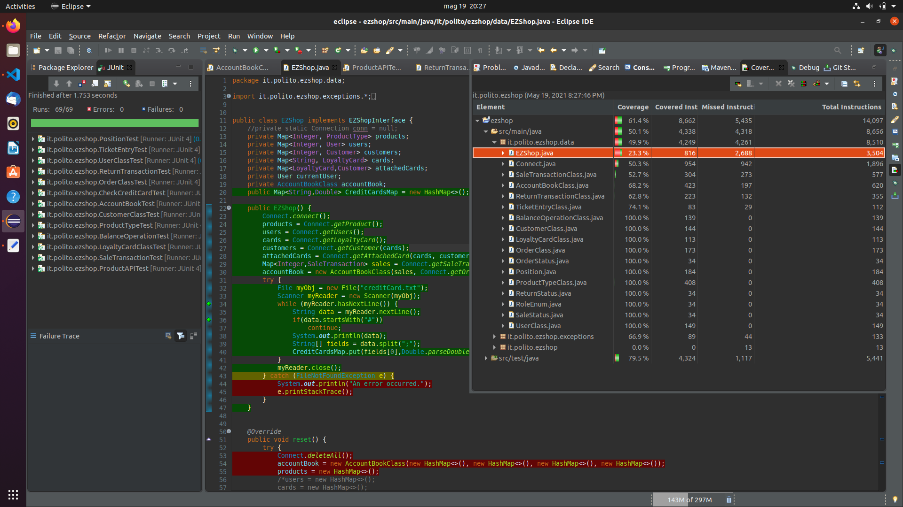

# Unit Testing Documentation

Authors:
Gambino Matteo, Valentini Valeria, Gigante Samuele, Basilico Michele

Date:
19/05/2021

Version:
1.0
# Contents

- [Black Box Unit Tests](#black-box-unit-tests)

- [White Box Unit Tests](#white-box-unit-tests)

# Black Box Unit Tests

    <Define here criteria, predicates and the combination of predicates for each function of each class.
    Define test cases to cover all equivalence classes and boundary conditions.
    In the table, report the description of the black box test case and (traceability) the correspondence with the JUnit test case writing the 
    class and method name that contains the test case>
    <JUnit test classes must be in src/test/java/it/polito/ezshop   You find here, and you can use,  class TestEzShops.java that is executed  
    to start tests
    >
## Class UserClass
### Constructor
**Criteria for method Constructor:**
- Signature of id
- Signature of username
- Signature of password
- Signature of role

**Predicates for method Constructor:**
| Criterion   | Predicate     |
| ----------- | ------------- |
| Signature of id| > 0|
|   | <= 0|
| Signature of username| valid|
|   | null|
| Signature of password| valid |
|   | invalid |
| Signature of role| valid|
|   | invalid|
**Boundaries for method Constructor**:

| Criterion   | Boundary values |
| ----------- | --------------- |
| Signature of id| -inf, 0, +inf|
**Combination of predicates for method Constructor**

 | Signature of id | Signatue of username| Signature of password | Value of role|Valid/Invalid | Description of the test case | JUnit test case |
| ----------- | ---|---|------------ | ---------------------------- | --------------- | ------|
| <= 0  | *     | *     |*| Invalid| T1(0,"username","password",RoleEnum.Administrator)->Exception| UserClassTest.testUserClassConstructor|
| *| null | *     | *|Invalid| T2(1,null,"password",RoleEnum.Administrator)->Exception| UserClassTest.testUserClassConstructor|
| *| * | null    | *|Invalid| T2(1,"username",null,RoleEnum.Administrator)->Exception| UserClassTest.testUserClassConstructor|
| *| * | *  | null|Invalid| T3(1,"username","password",null)->Exception| UserClassTest.testUserClassConstructor|
| >0| Valid    | Valid  | Valid | Valid | T4(1,"username","password",RoleEnum.Administrator)|UserClassTest.testUserClassConstructor|

### setUserId
**Criteria for method setUserId:**
- Signature of id

**Predicates for method setUserId:**
| Criterion   | Predicate     |
| ----------- | ------------- |
| Signature of id| null or <= 0|
|   |   > 0|

**Boundaries for method setUserId**:

| Criterion   | Boundary values |
| ----------- | --------------- |
| Signature of id| null, -inf, 0, +inf|

**Combination of predicates for method setProductId**

| Signature of id| Valid/Invalid | Description of the test case | JUnit test case |
| ----------- | ------------- | ---------------------------- | --------------- |
| null  or <= 0| Invalid | T1(null)->Exception   T1b(-1)->Exception| testSetUserId|
| > 0| Valid | T2(50)| testSetUserId|

### setUsername
- Signature of username
- Length of username

**Predicates for method setUsername:**
| Criterion   | Predicate     |
| ----------- | ------------- |
| Signature of username | null|
|   | valid|
| Length of username | 0 |
| | > 0|

**Boundaries for method setUsername**:

| Criterion   | Boundary values |
| ----------- | --------------- |
| Length of username | 0, +inf |

**Combination of predicates for method setUsername**
| Signature of username| Length of username| Valid/Invalid | Description of the test case | JUnit test case |
| ----------- | ---|------------- | ---------------------------- | --------------- |
| null  |  -  | Invalid | T1(null) -> Exception | testSetUsername|
| valid |  0  | Invalid | T2("")->Exception   |testSetUsername|
| Valid | > 0  | Valid   | T3("username")         |testSetUsername|

### setPassword
- Signature of password
- Length of password

**Predicates for method setPassword:**
| Criterion   | Predicate     |
| ----------- | ------------- |
| Signature of password | null|
|   | valid|
| Length of password | 0 |
| | > 0|

**Boundaries for method setPassword**:

| Criterion   | Boundary values |
| ----------- | --------------- |
| Length of password | 0, +inf |

**Combination of predicates for method setPassword**
| Signature of password| Length of password| Valid/Invalid | Description of the test case | JUnit test case |
| ----------- | ---|------------- | ---------------------------- | --------------- |
| null  |  -  | Invalid | T1(null) -> Exception | testSetPassword|
| Valid |  0  | Invalid | T2("")->Exception   |testSetPassword|
| Valid | >0  | Valid   | T3("password")         |testSetPassword|

### setRole
- Signature of role
- Validity of role string

**Predicates for method setRole:**
| Criterion   | Predicate     |
| ----------- | ------------- |
| Signature of role | invalid|
|| Valid|
|Validity of role string| invalid|
||valid|

**Combination of predicates for method setRole**
| Signature of role |Validity of role string|Valid/Invalid | Description of the test case | JUnit test case |
| ----------- | ------|------------- | ---------------------------- | -----|
| null  | * | Invalid | T1(null) -> Exception | testSetRole|
| Valid | Invalid | Invalid   | T2("Administratoro")-> Exception  T2b("Cashiero")-> Exception T2c("ShopManagero")->Exception    |testsetRole|
| Valid | Valid | Valid   | T3("Administrator")  T3b("Cashier") T3c("ShopManager")      |testsetRole|

## Class ProductTypeClass
### Method validateBarCode

**Criteria for method validateBarCode:**	
- Signature of String barcode
- Length of barcode
- Presence of not numeric characters in barcode
- Valid barcode

**Predicates for method validateBarCode:**

| Criterion   | Predicate     |
| ----------- | ------------- |
| Signature of String barcode | null |
|             | valid |
| Length of barcode | < 12 || > 14|
|             | >= 12 && <= 14 |
| Presence of not numeric characters in barcode         | yes, not spaces          |
|             |     no or only spaces          |
| Valid barcode| yes|
|               | no|

**Boundaries for method validateBarCode**:

| Criterion   | Boundary values |
| ----------- | --------------- |
| Length of barcode| 0, 12, 14, +inf             |

 **Combination of predicates for method validateBarCode**

| Signature of String barcode | Length of barcode | Presence of not numeric characters in barcode |Valid barcode| Valid/Invalid | Description of the test case | JUnit test case |
| ----------- | ----------- | ----------- |----| ------------- | ---------------------------- | --------------- |
|  null       |  *          |  *          | *   |   invalid     |  T1(null) -> false           | testValidateBarCode            |
|  valid      | < 12 || > 14|  *          | *   |   invalid     |   T2("4006381333")->false   T2b("40063813339054")->false   T2c("")->false|  testValidateBarCode     |
|  valid | >= 12 && <= 14| yes, not spaces| *   | invalid  | T3("asdasdasdsdas")->false     |  testValidateBarCode               |
|  valid | >= 12 && <= 14| no or only spaces    | no  | invalid  | T4("4006381333939")->false   T4b("400638133396")->false   T4c("4006381333905")->false   T4d(" 400 638 133 3901 ")->false                             | testValidateBarCode                |
|  valid | >= 12 && <= 14| no or only spaces    | yes  | valid  | T5("4006381333931")->true   T5b("400638133390")->true   T5c("4006381333900")->true| testValidateBarcode |

### Constructor
**Criteria for method Constructor:**

- Signature of id
- Signature of description
- Signature of productCode
- Signature of unitPrice

**Predicates for method Constructor:**
| Criterion   | Predicate     |
| ----------- | ------------- |
| Signature of id| > 0|
|   | <= 0|
| Signature of description| null|
|   | valid|
| Signature of productCode| invalid (null, empty or not valid)|
|   | valid|
| Signature of unitPrice| > 0|
|   | <= 0|

**Boundaries for method Constructor**:

| Criterion   | Boundary values |
| ----------- | --------------- |
| Signature of id| -inf, 0, +inf|
| Signature of unitPrice| -inf, 0, +inf|

**Combination of predicates for method Constructor**

| Signature of id | Signature of description | Signature of productCode |Signature of unitPrice|| Valid/Invalid | Description of the test case | JUnit test case |
| ----------- | ----------- |----| ------------- | ---------------------------- | --------------- |-|-|
| <= 0 | *  |*  |*  | Invalid | T1(0, "null", "4006381333900", 1.0, null)->Exception | testProductTypeConstructor|
| > 0   | null| *   | * | Invalid | T2(1, null, "4006381333900", 1.0, null)->Exception |testProductTypeConstructor|
| > 0   | valid| invalid| * | Invalid | T3(1, "null", "40063813339", 1.0, null)->Exception|testProductTypeConstructor|
| > 0   | valid| valid| <= 0 | Invalid | T4(1, "null", "4006381333900", -0.0, null)->Exception|testProductTypeConstructor|
| > 0   | valid| valid| > 0 | Valid | T5(1, "null", "4006381333900", 2.0, "notes")->ProductTypeClass|testProductTypeConstructor|
### updateQuantity
**Criteria for method updateQuantity:**
- Quantity + toBeAdded

**Predicates for method updateQuantity:**
| Criterion   | Predicate     |
| ----------- | ------------- |
| Quantity + toBeAdded | >= 0|
|   | < 0|

**Boundaries for method updateQuantity**:

| Criterion   | Boundary values |
| ----------- | --------------- |
| Quantity + toBeAdded | -inf, 0, +inf|

**Combination of predicates for method updateQuantity**

| Quantity + toBeAdded| Valid/Invalid | Description of the test case | JUnit test case |
| ----------- | ------------- | ---------------------------- | --------------- |
| < 0   | Invalid | new ProductTypeClass(); updateQuantity(-1) | testUpdateQuantity|
| >= 0  | Valid   | T2(2)->true   T2b(0)->true   |testUpdateQuantity|

### setProductId
**Criteria for method setProductId:**
- Signature of description
- Length of description

**Predicates for method setProductId:**
| Criterion   | Predicate     |
| ----------- | ------------- |
| Signature of description | null|
|   | valid|
| Length of description | 0 |
| | > 0|

**Boundaries for method setProductId**:

| Criterion   | Boundary values |
| ----------- | --------------- |
| Length of description | 0, +inf |

**Combination of predicates for method setProductId**

| Signature of description| Length of description| Valid/Invalid | Description of the test case | JUnit test case |
| ----------- | ---|------------- | ---------------------------- | --------------- |
| null  |  -  | Invalid | new ProductTypeClass(); setProductId(null) -> Exception | testDescription|
| valid |  0  | Invalid | T2("")->Exception   |testDescription|
| Valid | >0  | Valid   | T3("prova")         |testDescription|

### setProductId
**Criteria for method setProductId:**
- Signature of id

**Predicates for method setProductId:**
| Criterion   | Predicate     |
| ----------- | ------------- |
| Signature of id| null or <= 0|
|   |   > 0|

**Boundaries for method setProductId**:

| Criterion   | Boundary values |
| ----------- | --------------- |
| Signature of id| null, -inf, 0, +inf|

**Combination of predicates for method setProductId**

| Signature of id| Valid/Invalid | Description of the test case | JUnit test case |
| ----------- | ------------- | ---------------------------- | --------------- |
| null  or <= 0| Invalid | T1(null)->Exception   T1b(-1)->Exception| testProductId|
| > 0| Valid | T2(1231)| testProductId|

### setLocation
**Criteria for method setLocation:**
- Signature of Location
- Valid location

**Predicates for method setLocation:**
| Criterion   | Predicate     |
| ----------- | ------------- |
| Signature of Location | null|
|   | valid|
| Valid location | yes|
|       | no|

**Boundaries for method setLocation**:

| Criterion   | Boundary values |
| ----------- | --------------- |
| | |

**Combination of predicates for method setLocation**

| Signature of location| Valid location | Valid/Invalid | Description of the test case | JUnit test case |
| ----------- | ---|------------- | ---------------------------- | --------------- |
| null | - | Invalid | T1((String)null)   T1b((Position)null)|testSetPosition|
| valid| no| Invalid | T2("")|testSetPosition|
| valid| yes| Valid | T3("1_a_1") |testSetPosition|

## Class Position
### Constructor
**Criteria for method Constructor:**
- Valid position
- Fields of location = 3

**Predicates for method Constructor:**
| Criterion   | Predicate     |
| ----------- | ------------- |
| Fields of location = 3| yes|
| | no|
| Valid position | yes|
|       | no|

**Boundaries for method Constructor**:

| Criterion   | Boundary values |
| ----------- | --------------- |
| | |

**Combination of predicates for method Constructor**

| Valid position | Fields of location = 3|Valid/Invalid | Description of the test case | JUnit test case |
| ----------- | ---|------------- | ---------------------------- | --------------- |
| yes | no|Valid | T1(null)   T2("") | PositionTest.testConstructor|
| "   | yes| Valid| T3("1-b-2") | PositionTest.testConstructor|
| no  | no | Invalid| T4("-a")|PositionTest.testConstructor|
| "   | yes| Invalid| T5("1--4")->Exception   T6("a-2-c")->Exception   T7("1_2_3_4")->Exception|PositionTest.testConstructor|

### Equals
**Criteria for method Equals:**
- Signature of oth
- Fields of oth Position
- Class of oth

**Predicates for method Equals:**
| Criterion   | Predicate     |
| ----------- | ------------- |
| Signature of oth | null|
|       | valid|
| Class of oth| same|
| | different|
| Fields of oth Position| all same|
| | >= 1 different|

**Boundaries for method Equals**:

| Criterion   | Boundary values |
| ----------- | --------------- |
| | |

**Combination of predicates for method Equals**

| Signature of oth | Class of oth|Fields of oth Position|Valid/Invalid | Description of the test case | JUnit test case |
| ----------- | ---|---|------------ | ---------------------------- | --------------- |
| null | * | * | Invalid | T1(null)->false| PositionTest.testEquals|
| valid|different| *| Invalid| T2("")->false| PositionTest.testEquals|
| valid| same| >= 1 different| Invalid | Position p1 = new Position("1-a-1"); T3("2-a-1")->false   Position p1 = new Position("1-a-1"); T3b("1-b-1")->false   Position p1 = new Position("1-a-1"); T3c("1-a-2")->false|PositionTest.testEquals|
|valid|same| all same| Valid| Position p1 = new Position("1-a-1"); T3c("1-a-1")->true|PositionTest.testEquals|
## Class OrderClass
### Constructor
**Criteria for method Constructor:**
- Signature of productCode
- Value of unitPrice
- Value of quantity

**Predicates for method Constructor:**
| Criterion   | Predicate     |
| ----------- | ------------- |
| Signature of productCode| null|
| | valid|
| Value of unitPrice | > 0.0|
|       | <= 0.0| 
| Value of quantity| > 0|
| | <= 0|

**Boundaries for method Constructor**:

| Criterion   | Boundary values |
| ----------- | --------------- |
| Value of unitPrice| -inf, 0, +inf |
| Value of quantity| -inf, 0, +inf |

**Combination of predicates for method Constructor**

| Signature of productCode | Value of unitPrice| Value of quantity|Valid/Invalid | Description of the test case | JUnit test case |
| ----------- | ---|---|------------ | ---------------------------- | --------------- |
| null | *      | *     | Invalid| T1(1, "ORDER", 10, LocalDate.now(), null, null, 1, 10, OrderStatus.ISSUED)->Exception| OrderClassTest.testConstructor|
| valid| <= 0   | *     | Invalid| T2(1, "ORDER", 10, LocalDate.now(), null, "4006381333931", -0.0, 10, OrderStatus.ISSUED)->Exception| OrderClassTest.testConstructor|
| valid| > 0    | <=0   | Invalid| T3(1, "ORDER", 10, LocalDate.now(), null, "4006381333931", 1, -10, OrderStatus.ISSUED)->Exception|OrderClassTest.testConstructor|
| valid| > 0    | > 0   | Valid | T4(, "ORDER", 10, LocalDate.now(), null, "4006381333931", 1, 10, OrderStatus.ISSUED)|OrderClassTest.testConstructor|

### setOrderId
**Criteria for method setOrderId:**
- Signature of orderId
- Value of orderId

**Predicates for method setOrderId:**
| Criterion   | Predicate     |
| ----------- | ------------- |
| Signature of orderId | null|
|       | valid|
| Value of orderId| > 0|
| | <= 0|

**Boundaries for method setOrderId**:

| Criterion   | Boundary values |
| ----------- | --------------- |
| Value of orderId| -inf, 0, +inf |

**Combination of predicates for method setOrderId**

| Signature of orderId | Value of orderId|Valid/Invalid | Description of the test case | JUnit test case |
| ----------- | ---|------------ | ---------------------------- | --------------- |
| null  | - | Invalid| T1(null)->Exception| OrderClassTest.testSetOrderId|
| valid |<= 0| Invalid| T2(-1)->Exception| OrderClassTest.testSetOrderId|
| valid | > 0| Valid  | T3(2)|OrderClassTest.testSetOrderId|
### setQuantity
**Criteria for method setQuantity:**
- Value of quantity

**Predicates for method setQuantity:**
| Criterion   | Predicate     |
| ----------- | ------------- |
| Value of quantity| > 0|
| | <= 0|

**Boundaries for method setQuantity**:

| Criterion   | Boundary values |
| ----------- | --------------- |
| Value of quantity| -inf, 0, +inf |

**Combination of predicates for method setQuantity**

| Value of quantity|Valid/Invalid | Description of the test case | JUnit test case |
| ----------- | ------------ | ---------------------------- | --------------- |
| <= 0 | Invalid| T1(-1)->Exception| OrderClassTest.testSetQuantity|
| > 0  | Valid| T2(1)| OrderClassTest.testSetQuantity|
### setPricePerUnit
**Criteria for method setPricePerUnit:**
- Value of pricePerUnit

**Predicates for method setPricePerUnit:**
| Criterion   | Predicate     |
| ----------- | ------------- |
| Value of pricePerUnit| > 0|
| | <= 0|

**Boundaries for method setPricePerUnit**:

| Criterion   | Boundary values |
| ----------- | --------------- |
| Value of pricePerUnit| -inf, 0, +inf |

**Combination of predicates for method setPricePerUnit**

| Value of pricePerUnit|Valid/Invalid | Description of the test case | JUnit test case |
| ----------- | ------------ | ---------------------------- | --------------- |
| <= 0 | Invalid| T1(-0.0)->Exception| OrderClassTest.testSetPricePerUnit|
| > 0  | Valid| T2(2.0)| OrderClassTest.testSetPricePerUnit|

### setProductCode
**Criteria for method setProductCode:**
- Signature of productCode
- Validity of productCode

**Predicates for method setProductCode:**
| Criterion   | Predicate     |
| ----------- | ------------- |
| Signature of productCode | null|
|       | valid|
| Validity of productCode| valid|
| | invalid|

**Boundaries for method setProductCode**:

| Criterion   | Boundary values |
| ----------- | --------------- |
| ||

**Combination of predicates for method setProductCode**

| Signature of productCode | Validity of productCode|Valid/Invalid | Description of the test case | JUnit test case |
| ----------- | ---|------------ | ---------------------------- | --------------- |
| null  | -     | Invalid| T1(null)->Exception  | OrderClassTest.testSetProductCode|
| valid | invalid| Invalid| T2("")->Exception   | OrderClassTest.testSetProductCode|
| valid | valid | Valid   | T3("4006381333900") | OrderClassTest.testSetProductCode|

## Class SaleTransactionClass
### Constructor

**Criteria for method Constructor:**

- Signature of price
- Signature of payment type
- Validity of Time
- Validity of SaleStatus
- Validity of loyaltyCard
- Signature of transactionId
- Validity of ticketEntries
- Signature of discount rate

**Predicates for method Constructor:**

| Criterion   | Predicate     |
| ----------- | ------------- |
| Signature of price| (> 0)      |
| | <=0      |
| Signature of payment type| null       |
| | valid      |
| Validity of payment type  |   valid |
|   |   invalid |
| Validity of Time | valid |
|                    |  No |
| Validity of SaleStatus | valid      |
| | invalid      |
| Validity of loyaltyCard | valid|
|               | null|
| Signature of transactionId | (>=0) |
|             | <0 |
| Validity of ticketEntries | valid |
|   | null |
| Signature of discount rate | >=0  && <=1|
| | <0 or >1      |

**Boundaries for method Constructor**:

| Criterion   | Boundary values |
| ----------- | --------------- |
| Signature of transactionId  |    0, +inf       |
| Signature of price  | 0, +inf  |
| Signature of discount rate  | 0, 1  |

**Combination of predicates for method Constructor**

| Signature of price | Validity of price | Signature of payment type | Validity of payment type | Existence of Time object | Existence of SaleStatus |   Existence of FidelityCard object | Signature of transactionId  | Validity of transactionId | Signature of ticketEntries | Validity of discount rate |  Valid/Invalid | Description of the test case: example of input and output |  JUnit test case  |
| --------- | --------- | ------- |--------| ------ | -------- | ------- | -------- | -------- | ------- | ------- | ------- | ------- | ------ |
|   null     |  *       |    *     | * | * | * | * | * | * | * | * | * |   Invalid    |   T1(null, "CASH", new Time(System.currentTimeMillis), SaleStatus.STARTED, new LoyaltyCard("1234567890", 1), 10, new HashMap<>(), 0.1) ->  Exception      | SaleTransactionTest.testSaleTransactionConstructor  |
|   invalid     |  <=0      |    *     | * | * | * | * | * | * | * | * |   Invalid    |   T2(-1, "CASH", new Time(System.currentTimeMillis), SaleStatus.STARTED, new LoyaltyCard("1234567890", 1), 10, new HashMap<>(), 0.1) ->  Exception      | SaleTransactionTest.testSaleTransactionConstructor  |
|   valid     |  > 0       |    null     | * | * | * | * | * | * | * | * |   Invalid    |   T3(10, null, new Time(System.currentTimeMillis), SaleStatus.STARTED, new LoyaltyCard("1234567890", 1), 10, new HashMap<>(), 0.1) ->  InvalidPaymentException      | SaleTransactionTest.testSaleTransactionConstructor  |
|   valid     |  > 0       |   valid  | invalid | * | * | * | * | * | * | * |   Invalid    |   T4(10, "other", new Time(System.currentTimeMillis), SaleStatus.STARTED, new LoyaltyCard("1234567890", 1), 10, new HashMap<>(), 0.1) ->  InvalidPaymentException      | SaleTransactionTest.testSaleTransactionConstructor  |
|   valid     |  > 0       |    valid     | valid | null | * | * | * | * | * | * |   Invalid    |   T5(10, "CASH", null, SaleStatus.STARTED, new LoyaltyCard("1234567890", 1), 10, new HashMap<>(), 0.1) ->  Exception      | SaleTransactionTest.testSaleTransactionConstructor  |
|   valid     |  > 0       |    valid     | valid | valid | null | * | * | * | * | * |   Invalid    |   T6(10, "CASH", new Time(System.currentTimeMillis), null, new LoyaltyCard("1234567890", 1), 10, new HashMap<>(), 0.1) ->  Exception      | SaleTransactionTest.testSaleTransactionConstructor  |
|   valid     |  > 0       |    valid     | valid | valid | valid | null | * | * | * | * |   Invalid    |   T7(10, "CASH", new Time(System.currentTimeMillis), SaleStatus.STARTED, null, 10, new HashMap<>(), 0.1) ->  InvalidCustomerCardException      | SaleTransactionTest.testSaleTransactionConstructor  |
|   valid     |  > 0       |    valid     | valid | valid | valid | valid | null | * | * | * |   Invalid    |   T8(10, "CASH", new Time(System.currentTimeMillis), SaleStatus.STARTED, new LoyaltyCard("1234567890", 1), null, new HashMap<>(), 0.1) ->  Exception      | SaleTransactionTest.testSaleTransactionConstructor  |
|   valid     |  > 0       |    valid     | valid | valid | valid | valid | valid | invalid | * | * |   Invalid    |   T9(10, "CASH", new Time(System.currentTimeMillis), SaleStatus.STARTED, new LoyaltyCard("1234567890", 1), -1, new HashMap<>(), 0.1) ->  InvalidTransactionIdException      | SaleTransactionTest.testSaleTransactionConstructor  |
|   valid     |  > 0       |    valid     | valid | valid | valid | valid | valid | valid | null | * |   Invalid    |   T10(10, "CASH", new Time(System.currentTimeMillis), SaleStatus.STARTED, new LoyaltyCard("1234567890", 1), 10, null, 0.1) ->  Exception      | SaleTransactionTest.testSaleTransactionConstructor  |
|   valid     |  > 0       |    valid     | valid | valid | valid | valid | valid | valid | <=0 | invalid |   Invalid    |   T11(10, "CASH", new Time(System.currentTimeMillis), SaleStatus.STARTED, new LoyaltyCard("1234567890", 1), 10, new HashMap<>(), -1) ->  Exception      | SaleTransactionTest.testSaleTransactionConstructor  |
|   valid     |  > 0       |    valid     | valid | valid | valid | valid | valid | valid | >1 | invalid |   Invalid    |   T11(10, "CASH", new Time(System.currentTimeMillis), SaleStatus.STARTED, new LoyaltyCard("1234567890", 1), 10, new HashMap<>(), 2) ->  Exception      | SaleTransactionTest.testSaleTransactionConstructor  |
|   valid     |  > 0       |    valid     | valid | valid | valid | valid | valid | valid | valid | >0 && <1 | valid |   T13(10, "CASH", new Time(System.currentTimeMillis), SaleStatus.STARTED, new LoyaltyCard("1234567890", 1), 10, new HashMap<>(), 0.1) ->  new SaleTransactionClass succesfully generated      | SaleTransactionTest.testSaleTransactionConstructor  |

### setTime
**Criteria for method setTime:**
- Signature of time

**Predicates for method setTime:**
| Criterion   | Predicate     |
| ----------- | ------------- |
| Signature of time | null |
|       | valid instance of Time.class |

**Boundaries for method setTime**:

| Criterion   | Boundary values |
| ----------- | --------------- |
| | |

**Combination of predicates for method setTime**

| Signature of time |Valid/Invalid | Description of the test case | JUnit test case |
| ----------- |------------ | ---------------------------- | --------------- |
| null  | Invalid| T1(null)->Exception | SaleTransactionClassTest.testTime |
| valid | Valid | T2(System.currentTimeMillis)-> correctly set the time of the Sale Transaction Class object| SaleTransactionClassTest.testTime |

### setStatus
**Criteria for method setStatus:**
- Signature of status

**Predicates for method setStatus:**
| Criterion   | Predicate     |
| ----------- | ------------- |
| Signature of status | null|
|       | valid instance of SaleStatus.class |

**Boundaries for method setStatus**:

| Criterion   | Boundary values |
| ----------- | --------------- |
| | |

**Combination of predicates for method setStatus**

| Signature of status |Valid/Invalid | Description of the test case | JUnit test case |
| ----------- | ------------ | ---------------------------- | --------------- |
| null  | Invalid | T1(null)->Exception | SaleTransactionClassTest.testStatus|
| valid |  Valid | T2(SaleStatus.STARTED)-> correctly set the status of the Sale Transaction Class object | SaleTransactionClassTest.testStatus |

### setTicketNumber
**Criteria for method setTicketNumber:**
- Signature of ticketNumber
- Validity of ticketNumber

**Predicates for method setTicketNumber:**
| Criterion   | Predicate     |
| ----------- | ------------- |
| Signature of ticket number | null |
|       | valid  |
| Validity of ticket number | <=0 |
|       | >0  |

**Boundaries for method setTicketNumber**:

| Criterion   | Boundary values |
| ----------- | --------------- |
| Value of ticketNumber | -inf, 0, +inf |

**Combination of predicates for method setTicketNumber**

| Signature of ticketNumber | Value of ticketNumber | Valid/Invalid | Description of the test case | JUnit test case |
| ----------- | ---|------------ | ---------------------------- | --------------- |
| null  | - | Invalid| T1(null)->InvalidTransactionIdException | SaleTransactionClassTest.testTicketNumber |
| valid | <=0 | invalid | T2(-1)->InvalidTransactionIdException | SaleTransactionClassTest.testTicketNumber |
| valid  | >0  | valid | T3(5)-> correctly set the ticketNumber of the Sale Transaction Class object | SaleTransactionClassTest.testTicketNumber |

### setDiscountRate
**Criteria for method setDiscountRate:**
- Value of discountRate

**Predicates for method setDiscountRate:**
| Criterion   | Predicate     |
| ----------- | ------------- |
| Value of discountRate | <0 or >1 |
|       | 0< x < 1 |

**Boundaries for method setDiscountRate**:

| Criterion   | Boundary values |
| ----------- | --------------- |
| Value of discountRate | -inf, 0, 1, +inf |

**Combination of predicates for method setDiscountRate**

| Value of discountRate | Valid/Invalid | Description of the test case | JUnit test case |
| ---|------------ | ---------------------------- | --------------- |
| <0 or >1  | Invalid| T1(-1)->InvalidDiscountRateException | SaleTransactionClassTest.testDiscountRate |
| 0<x<1 | T3(0.5)-> correctly set the discountRate of the Sale Transaction Class object | SaleTransactionClassTest.testDiscountRate |

### setPaymentType
**Criteria for method setPaymentType:**
- Validity of paymentType
- Signature of paymentType

**Predicates for method setPaymentType:**
| Criterion   | Predicate     |
| ----------- | ------------- |
| Signature of paymentType | null |
|                         | valid |
| Validity of paymentType | invalid |
|       | valid |

**Boundaries for method setPaymentType**:

| Criterion   | Boundary values |
| ----------- | --------------- |
|  |  |

**Combination of predicates for method setPaymentType**

| Signature of paymentType | Value of paymentType | Valid/Invalid | Description of the test case | JUnit test case |
| ---- | ------------ | ---------- | ---------------------------- | --------------- |
| null | * | Invalid | T1(null)->InvalidPaymentException | SaleTransactionClassTest.testPaymentType |
| valid | invalid | invalid | T2("other")->InvalidPaymentException | SaleTransactionClassTest.testPaymentType |
| valid | valid | T3("CASH")-> correctly set the paymentType of the Sale Transaction Class object | SaleTransactionClassTest.testPaymentType |

## Class EZShop

### Method CheckCreditCardNumber

Criteria for method CheckCreditCardNumber:

- Validity of CreditCard
- Acceptable Credit Card
- Existence of CreditCard in the system
- Length of CreditCard

Predicates for method CheckCreditCardNumber:

| Criterion   | Predicate     |
| ----------- | ------------- |
| Validity of CreditCard | valid |
|             | null |
| Acceptable Credit Card | true |
|                        | false |
| Existence of CreditCard in the system | true |
|               | false |
| Length of CreditCard | valid |
|                                     |  invalid |

Boundaries for method CheckCreditCardNumber:

| Criterion   | Boundary values |
| ----------- | --------------- |
| Length of CreditCard  |    -inf, 13, 16, +inf       |

Combination of predicates for method CheckCreditCardNumber

|   Validity of CreditCard | Acceptable Credit Card | Existence of CreditCard in the system | Length of CreditCard | Valid/Invalid | Description of the test case: example of input and output |  JUnit test case  | 
| --------- | --------- | ------- |--------| ------ | -------- | ------- |
|   null     |  *       |    *    |    *    | Invalid |   T1(null) ->  InvalidCreditCardException      | CheckCreditCard.testCheckCreditCardNumber |
|   valid     |  false  |    *    |   *   |    Invalid    |    T2("1234567812345678") -> InvalidCreditCardException      | CheckCreditCard.testCheckCreditCardNumber |
|   "     |  true      |   false  | *      | Invalid    |   No Credit Card "1234567812345679" in the system; T3("1234567812345679") ->  InvalidCreditCardException      | CheckCreditCard.testCheckCreditCardNumber |
|   "     |  "       |  true   |   Invalid  | Invalid  | updateCreditCardTxt("49927398716",100)  ->  T4("49927398716")   ->  InvalidCreditCardException      | CheckCreditCard.testCheckCreditCardNumber |
| "  |  "  |  "  |  Valid  |  Valid  |  updateCreditCardTxt("1234567812345678",100)  ->  T5("1234567812345678")| CheckCreditCard.testCheckCreditCardNumber|

## Class AccountBookClass

### Method removeSaleTransaction

Criteria for method removeSaleTransaction:
  

- Value of returnTransactionId
- Signature of returnTransactionId
- Existence of SaleTransaction object

Predicates for method removeSaleTransaction:

| Criterion   | Predicate     |
| ----------- | ------------- |
| Value of returnTransactionId | >=0 |
|             | <0 |
| Signature of returnTransactionId| valid|
|               | null|
| Existence of SaleTransaction object | Yes |
|                                     |  No |

Boundaries for method removeSaleTransaction:

| Criterion   | Boundary values |
| ----------- | --------------- |
| Value of returnTransactionId  |    -inf, 0, +inf       |

 Combination of predicates for method removeSaleTransaction

|   Signature of returnTransactionId | Value of returnTransactionId | Existence of SaleTransaction object | Valid/Invalid | Description of the test case: example of input and output |  JUnit test case  | 
| --------- | --------- | ------- |--------| ------ | -------- |
|   null     |  *       |    *    |    Invalid    |   T1(null) ->  InvalidTransactionIdException      |  AccountBookTest.testInvalidRemoveSaleTransaction|
|   valid     |  <0       |   *   |    Invalid    |    T2(-6) -> InvalidTransactionIdException      | AccountBookTest.testInvalidRemoveSaleTransaction |
|   "     |  (>=)0       |  no      | Invalid    |   removeSaleTransaction(100); removeSaleTransaction(100) ->  InvalidTransactionIdException      | AccountBookTest.testInvalidRemoveSaleTransaction |
|   "     |  "       |  yes   |   Valid    | removeSaleTransaction(100);  ->  SaleTransaction removed successfully         | AccountBookTest.testRemoveSaleTransaction |

### Method setBalance

Criteria for method setBalance:
  
- Value of amount

Predicates for method setBalance:

| Criterion   | Predicate     |
| ----------- | ------------- |
| Value of balance | >=0 |
|             | <0 |

Boundaries for method setBalance:
| Criterion   | Boundary values |
| ----------- | --------------- |
| Value of balance |    -inf, +inf       |

 Combination of predicates for method setBalance

| Value of amount  | Valid/Invalid | Description of the test case: example of input and output |  JUnit test case  | 
| --------- | --------| --------| --------| 
|  <0    | Invalid         |   T1(-500) ->  false     | AccountBook.testSetBalance  |
|  (>=0)    | Valid         |   T1(500) ->  true     |  AccountBook.testSetBalance |

### Method getSaleTransaction

Criteria for method getSaleTransaction:

- Value of SaleTransactionId
- Signature of SaleTransactionId
- Existence of SaleTransaction object

**Predicates for method getSaleTransaction:**

| Criterion   | Predicate     |
| ----------- | ------------- |
| Value of SaleTransactionId | >=0 |
|             | <0 |
| Signature of SaleTransactionId| valid|
|               | null|
| Existence of SaleTransaction object | Yes |
|                                     |  No |

**Boundaries for method getSaleTransaction:**

| Criterion   | Boundary values |
| ----------- | --------------- |
| Value of SaleTransactionId  |    -inf, 0, +inf       |

Combination of predicates for method getSaleTransaction

|   Signature of SaleTransactionId | Value of SaleTransactionId | Existence of SaleTransaction object | Valid/Invalid | Description of the test case: example of input and output |  JUnit test case  | 
| --------- | --------- | ------- |--------| ------ | -------- |
|   null     |  *       |    *    |    Invalid    |   T1(null) ->  InvalidTransactionIdException      | AccountBook.testInvalidGetSaleTransaction |
|   valid     |  <0       |   *   |    Invalid    |    T2(-5) -> InvalidTransactionIdException      | AccountBook.testInvalidGetSaleTransaction |
|   "     |  (>=)0       |  no      | Invalid    |   removeSaleTransaction(500); getSaleTransaction(500) ->  InvalidTransactionIdException      | AccountBook.testInvalidGetSaleTransaction |
|   "     |  "       |  yes   |   Valid    | addSaleTransaction(500); getSaleTransaction(500);  ->  SaleTransaction removed successfully         | AccountBook.testGetSaleTransaction |

## Class BalanceOperation

### BalanceOperationClass(double,String)
Criteria for method BalanceOperationClass:
- Value of money
- Validity of type
- Presence of numeric character in type

**Predicates for method BalanceOperationClass:**

| Criterion   | Predicate     |
| ----------- | ------------- |
| Value of money | (>=0) |
| | <0 |
| Presence of numeric character| true |
|       |   false|
| Validity of type | true |
|                   | false|

**Boundaries for method BalanceOperationClass:**

| Criterion   | Boundary values |
| ----------- | --------------- |
| Value of money | -inf, 0, +inf |

Combination of predicates for method BalanceOperationClass

| Signature of money | Presence of numeric character| Validity of BalanceId | Valid/Invalid |Description of the test case: example of input and output |  JUnit test case  | 
| ----------- | ---| ---|------------- | -------- | ------- |
| <0  |  *  | *  | Invalid | T1(-1)  |  AccountBook.testConstructor   |
| (>=0) |  yes  | ---| Invalid | T2(deb1t)   |  AccountBook.testConstructor |
| " | no  | no | Invalid   | T3(ciao)         |AccountBook.testConstructor|
| " | "  | yes | Valid   | T4(credit)         |AccountBook.testConstructor|

### setBalanceId
Criteria for method setBalanceId:
- Value of BalanceId

**Predicates for method setBalanceId:**
| Criterion   | Predicate     |
| ----------- | ------------- |
| Value of BalanceId | <0 |
| | >= 0|

**Boundaries for method setBalanceId:**

| Criterion   | Boundary values |
| ----------- | --------------- |
|  |  |

**Combination of predicates for method setBalanceId**
| Value of BalanceId | Valid/Invalid |Description of the test case: example of input and output |  JUnit test case  | 
| ----------- | ------------- | -------- | ------- |
| <0  |  Invalid | T1(-1)  |    AccountBook.testInvalidSetBalanceId |
| >=0 |  Valid   | T3(10)         |AccountBook.testSetBalanceId|

### setDescription
Criteria for method setDescription:
- Signature of Description
- Length of string

**Predicates for method setDescription:**

| Criterion   | Predicate     |
| ----------- | ------------- |
| Signature of Description | null |
| | valid|
| Length of string | <=1000 |
|   | (>1000) |

**Boundaries for method setDescription:**

| Criterion   | Boundary values |
| ----------- | --------------- |

**Combination of predicates for method setDescription**

| Signature of Description | Length of string | Valid/Invalid |Description of the test case: example of input and output |  JUnit test case  | 
| --- | ------ |------------- | -------- | ------- |
| null  |  *  | Invalid | T1(null; error)  |    AccountBook.testInvalidSetDescription |
| valid | (>1000)  | Invalid   | T2("cia90......";)   | AccountBook.testInvalidSetDescription  |
| "    | <=1000 | Valid   | T3("Nuova transazione")         |  AccountBook.testSetDescription |

## Class TicketEntryClass

### Constructor
**Criteria for method Constructor:**
- Signature of ProductType
- Validity of amount
- Validity of discountRate

**Predicates for method constructor:**

| Criterion   | Predicate     |
| ----------- | ------------- |
| Signature of ProductType | null |
| | valid |
| Validity of amount | <=0 |
| | >0 |
| Validity of discountRate | >1 or <0 |
| | 0<x<1 |

**Boundaries for method constructor**:

| Criterion   | Boundary values |
| ----------- | --------------- |
| Value of amount | -inf, 0, +inf |
| Value of discountRate | -inf, 0, 1, +inf |

**Combination of predicates for method constructor**

| Signature of ProductType | validity of amount | validity of discountRate | Valid/Invalid | Description of the test case: example of input and output |  JUnit test case  | 
|-|-|-|-|-|-|
| null | * | * | invalid | T1(null, 2, 0.3) -> Exception | TicketEntryTest.testTicketEntryConstructor |
| valid  | <=0 | * | invalid | T2(new ProductType((1, "null", "4006381333900", 2.0, "notes")), -1, 0.3) -> InvalidQuantityException | TicketEntryTest.testTicketEntryConstructor |
| valid | >0 | <0 or >1 | invalid | T3(new ProductType((1, "null", "4006381333900", 2.0, "notes")), 2, -1) -> InvalidDiscountRateException | TicketEntryTest.testTicketEntryConstructor |
| valid | >0 | 0< x <1 | valid | T5(new ProductType((1, "null", "4006381333900", 2.0, "notes")), 2, 0.5) -> correctly created a new TicketEntryClass object | TicketEntryTest.testTicketEntryConstructor |

### testSetAmount

**Criteria for method testSetAmount:**

- Validity of amount

**Predicates for method testSetAmount:**

| Criterion   | Predicate     |
| ----------- | ------------- |
| Validity of amount | <=0 |
|   | >0 |

**Boundaries for method testSetAmount**:

| Criterion   | Boundary values |
| ----------- | --------------- |
| Value of amount | -inf, 0, +inf |

**Combination of predicates for method testSetAmount**

| Validity of amount | Valid/Invalid | Description of the test case: example of input and output |  JUnit test case  |
|--|-|-|-|
| <=0 | invalid | T1(-1) -> InvalidQuantityException | TicketEntryClassTest.testSetAmount |
| >0 | valid | T2(3) -> Correctly updated quantity of the ticket entry | TicketEntryClassTest.testSetAmount |

### testSetDiscountRate

**Criteria for method testSetDiscountRate:**

- Validity of discountRate

**Predicates for method testSetDiscountRate:**

| Criterion   | Predicate     |
| ----------- | ------------- |
| Validity of discountRate | <0 or >1 |
|   | 0< x < 1 |

**Boundaries for method testSetDiscountRate**:

| Criterion   | Boundary values |
| ----------- | --------------- |
| Validity of discountRate | -inf, 0, 1, +inf |

**Combination of predicates for method testSetDiscountRate**

| Validity of discountRate | Valid/Invalid | Description of the test case: example of input and output |  JUnit test case  |
|--|-|-|-|
| <0 or >1 | invalid | T1(-1) -> InvalidDiscountRateException | TicketEntryClassTest.testSetDiscountRate |
| 0<1<x | valid | T2(0.2) -> Correctly updated discountRate of the ticket entry | TicketEntryClassTest.testSetDiscountRate |

## Class ReturnTransactionClass

### setStatus

**Criteria for method setStatus:**
- Signature of status
- Status allowed
- String contains only characters

**Predicates for method setStatus:**

| Criterion   | Predicate     |
| ----------- | ------------- |
| Signature of type | null |
| | valid|
| Type allowed | false |
|   | true |
| String contains only characters  |  false  |
|   |  true  |

**Boundaries for method setStatus**:

| Criterion   | Boundary values |
| ----------- | --------------- |
| Type allowed | "finish","payed" |
| String contains only characters | "closed50",'closed' |

**Combination of predicates for method setStatus**

| Signature of type | Type allowed | String contains only character | Valid/Invalid |Description of the test case: example of input and output |  JUnit test case  | 
| ----------- | --- | ------ |------------- | -------- | ------- |
| null  |  *  |  *  | Invalid | T1(null; error)  |     |
| valid | no  |  *  | Valid   | T2("pa1ed"; no output)   |   |

### setMoney

**Criteria for method setMoney:**
- Value of money

**Predicates for method setMoney:**

| Criterion   | Predicate     |
| ----------- | ------------- |
| Value of money | <0 |
| | >=0 |

**Boundaries for method setMoney**:

| Criterion   | Boundary values |
| ----------- | --------------- |
| Value of money | -inf, 0, +inf |

**Combination of predicates for method setMoney**

| Value of money | Valid/Invalid |Description of the test case: example of input and output |  JUnit test case  | 
| ----------- | ------------- | -------- | ------- |
| <0  | Invalid | T1(-1) -> Exception  | ReturnTransactionTest.testSetMoney    |
| >=0 | Valid | T2(50.0) -> correctly updated the money of the transaction   |  ReturnTransactionTest.testSetMoney     |

### setSaleTransaction

**Criteria for method setSaleTransaction:**
- Signature of SaleTransaction

**Predicates for method setSaleTransaction:**

| Criterion   | Predicate     |
| ----------- | ------------- |
| Signature of SaleTransaction | null |
| | valid |

**Boundaries for method setSaleTransaction**:

| Criterion   | Boundary values |
| ----------- | --------------- |
| | |

**Combination of predicates for method setSaleTransaction**

| Signature of SaleTransaction | Valid/Invalid | Description of the test case: example of input and output |  JUnit test case  | 
| ----------- | ------------- | -------- | ------- |
| null  | Invalid | T1(null) -> Exception  | ReturnTransactionTest.testSetSaleTransaction    |
| valid | Valid | T2(new SaleTransactionClass(10.0, "CREDIT_CARD", new Time(System.currentTimeMillis()),SaleStatus.STARTED, new LoyaltyCardClass("1234567890", 1), 2, new HashMap<>(), 0.1)) -> correctly updated the Sale Transaction   |  ReturnTransactionTest.testSetSaleTransaction     |

### setReturnedProduct

**Criteria for method setReturnedProduct:**
- Signature of ReturnedProduct

**Predicates for method setReturnedProduct:**

| Criterion   | Predicate     |
| ----------- | ------------- |
| Signature of ReturnedProduct | null |
| | valid |

**Boundaries for method setReturnedProduct**:

| Criterion   | Boundary values |
| ----------- | --------------- |
|  |  |

**Combination of predicates for method setReturnedProduct**

| Signature of ReturnedProduct | Valid/Invalid | Description of the test case: example of input and output |  JUnit test case  | 
| ----------- | ------------- | -------- | ------- |
| null  | Invalid | T1(null) -> Exception  | ReturnTransactionTest.testSetReturnedProduct    |
| valid | Valid | T2(new HashMap<>()) -> correctly updated ReturnedProduct   |  ReturnTransactionTest.testSetReturnedProduct     |

### setReturnId

**Criteria for method setReturnId:**
- Value of returnId
- Signature of returnId

**Predicates for method setReturnId:**

| Criterion   | Predicate     |
| ----------- | ------------- |
| Signature of returnId | null |
|   | valid |
| Value of returnId | <=0 |
| | >0 |

**Boundaries for method setReturnId**:

| Criterion   | Boundary values |
| ----------- | --------------- |
| Value of returnId | -inf, 0, +inf |

**Combination of predicates for method setReturnId**

| Signature of returnId | Value of returnId | Valid/Invalid |Description of the test case: example of input and output |  JUnit test case  | 
| ----------- | ------------- | ----- | -------- | ------- |
| null | * |  Invalid | T1(null) -> Exception  | ReturnTransactionTest.testSetReturnId    |
| valid  | <=0  | Invalid | T2(-1) -> Exception  | ReturnTransactionTest.testSetReturnId    |
| valid  | >0 | Valid | T3(5) -> correctly updated the returnId   |  ReturnTransactionTest.testSetReturnId     |

int orderId, String description, double amount, LocalDate date, String type,Map<ProductType, Integer> returned, SaleTransaction saleT, ReturnStatus retstatus
### Method constructor

**Criteria for method constructor**

- value of orderId
- signature of description
- value of amount
- signature of date
- signature of type
- value of type
- signature of returnedProducts
- signature of saleTransaction
- signature of retstatus

**Predicates for method constructor:**

| Criterion   | Predicate     |
| ----------- | ------------- |
| value of orderId | <=0 |
|   | >0 |
| signature of description | null |
|   | valid |
| value of amount | <=0 |
|   | >0 |
| signature of date | null |
|   | valid |
| signature of type | null |
|   | valid |
| value of type | invalid |
|   | valid |
| signature of returnedProducts | null |
|   | valid |
| signature of saleTransaction | null |
|   | valid |
| signature of retstatus | null |
|   | valid |

**Boundaries for method constructor**:

| Criterion   | Boundary values |
| ----------- | --------------- |
| value of orderId | -inf, 0, +inf   |
| value of amount | -inf, 0, +inf   |

**Combination of predicates for method constructor**

| value of orderId | signature of description | value of amount | signature of date | signature of type | value of type | signature of returnedProducts | signature of saleTransaction | signature of retstatus | Valid/Invalid | Description of the test case | JUnit test case | 
| ----------- | ----------- | ----------- | ------------- | ---------------------------- | --------------- | ----------- | ---------- | ----------- | -------- | ----------- | --------- |
| <=0 | *  | *  | *  | *  | *  | *  | *  | *  | invalid  | T1(-1, "description", 3.0, LocalDate.now(), "DEBIT",new HashMap<>(),(SaleTransaction) new SaleTransactionClass(10.0, "CREDIT_CARD", new Time(System.currentTimeMillis()),SaleStatus.STARTED, new LoyaltyCardClass("1234567890", 1), 2, new HashMap<>(), 0.1),ReturnStatus.STARTED) -> Exception |   |
| >0  | null   | *  | *  | *  | *  | *  | *  | *  | invalid  | T2(1, null, 3.0, LocalDate.now(), "DEBIT",new HashMap<>(),(SaleTransaction) new SaleTransactionClass(10.0, "CREDIT_CARD", new Time(System.currentTimeMillis()),SaleStatus.STARTED, new LoyaltyCardClass("1234567890", 1), 2, new HashMap<>(), 0.1),ReturnStatus.STARTED) -> Exception  | ReturnTransactionTest.testReturnTransactionConstructor  |
| >0  | valid  | <=0 | *  | *  | *  | *  | *  | *  | invalid  | T3(1, "description", -1, LocalDate.now(), "DEBIT",new HashMap<>(),(SaleTransaction) new SaleTransactionClass(10.0, "CREDIT_CARD", new Time(System.currentTimeMillis()),SaleStatus.STARTED, new LoyaltyCardClass("1234567890", 1), 2, new HashMap<>(), 0.1),ReturnStatus.STARTED) -> Exception  | ReturnTransactionTest.testReturnTransactionConstructor  |
| >0  | valid  | >0  |  null | *  | *  | *  | *  | *  | invalid  | T4(1, "description", 3.0, null, "DEBIT",new HashMap<>(),(SaleTransaction) new SaleTransactionClas(10.0, "CREDIT_CARD", new Time(System.currentTimeMillis()),SaleStatus.STARTED, new LoyaltyCardClass("1234567890", 1), 2, new HashMap<>(), 0.1),ReturnStatus.STARTED) -> Exception  | ReturnTransactionTest.testReturnTransactionConstructor  |
| >0  | valid  | >0  |  valid | null  | *  | *  | *  | *  | invalid  | T5(1, "description", 3.0, LocalDate.now(), null,new HashMap<>(),(SaleTransaction) new SaleTransactionClass(10.0, "CREDIT_CARD", new Time(System.currentTimeMillis()),SaleStatus.STARTED, new LoyaltyCardClass("1234567890", 1), 2, new HashMap<>(), 0.1),ReturnStatus.STARTED) -> Exception  | ReturnTransactionTest.testReturnTransactionConstructor  |
| >0  | valid  | >0  |  valid | valid  | invalid  | *  | *  | *  | invalid  | T6(1, "description", 3.0, LocalDate.now(), "DEBIT",null,(SaleTransaction) new SaleTransactionClass(10.0, "CREDIT_CARD", new Time(System.currentTimeMillis()),SaleStatus.STARTED, new LoyaltyCardClass("1234567890", 1), 2, new HashMap<>(), 0.1),ReturnStatus.STARTED) -> Exception  | ReturnTransactionTest.testReturnTransactionConstructor  |
| >0  | valid  | >0  |  valid | valid  | valid    | invalid | *  | *  | invalid  | T7(1, "description", 3.0, LocalDate.now(), "DEBIT",new HashMap<>(),null, 2, new HashMap<>(), 0.1),ReturnStatus.STARTED) -> Exception  | ReturnTransactionTest.testReturnTransactionConstructor  |
| >0  | valid  | >0  |  valid | valid  | valid    |  valid  | invalid  | *  | invalid  | T8(1, "description", 3.0, LocalDate.now(), "DEBIT",new HashMap<>(),(SaleTransaction) new SaleTransactionClass(10.0, "CREDIT_CARD", new Time(System.currentTimeMillis()),SaleStatus.STARTED, new LoyaltyCardClass("1234567890", 1), 2, new HashMap<>(), 0.1),ReturnStatus.STARTED) -> Exception  | ReturnTransactionTest.testReturnTransactionConstructor  |
| >0  | valid  | >0  |  valid | valid  | valid    | valid   | valid  | valid  | valid  | T9() -> Exception | ReturnTransactionTest.testReturnTransactionConstructor   |

## Class CustomerClass
### Method CheckCardCode
**Criteria for method  checkCardCode:**

- Signature of String newCustomerCard
- Length of newCustomerCard
- Valid newCustomerCard

**Predicates for method checkCardCode:**

| Criterion   | Predicate     |
| ----------- | ------------- |
| Signature of String newCustomerCard | null |
|             | valid |
| Length of barcode | 10 |
|             | > 10 or < 10 |
| Valid newCustomerCard| valid|
|               | invalid|

**Boundaries for method checkCardCode**:

| Criterion   | Boundary values |
| ----------- | --------------- |
| Length of newCustomerCard| 0, 10,+inf   

**Combination of predicates for method checkCardCode**

| Signature of newCardCode | Length of newCardCode || Valid/Invalid | Description of the test case | JUnit test case |
| ----------- | ----------- | ----------- | ------------- | ---------------------------- | --------------- |
|  null       |  *          |           |   invalid     |  T1(null) -> false           | testcheckCardCode    
|  valid | 0|   | invalid  | T2("")->false     |  testcheckCardCode               |
|  valid | >10 |   | invalid  | T4("abcde123456")->false  |testcheckCardCode                           | 
|  valid | <10 |   | invalid  | T4("abcde1234")->false                             | testcheckCardCode               |
|  valid | 10 |   | valid  | T5("abcde12345")->true   T5b("AN34d5vtA1")->true | testcheckCardCode |

## Class CustomerClass
### Constructor
**Criteria for method Constructor:**
- Signature of id
- Signature of customerName
- Signature of customerCard
- Signature of points

**Predicates for method Constructor:**

| Criterion   | Predicate     |
| ----------- | ------------- |
| Signature of id| > 0|
|   | <= 0|
| Signature of customerName| valid|
|   | null|
| Signature of customerCard| valid |
|   | invalid (null, empty or not valid)|
| Signature of points| >= 0|
|   | < 0|
**Boundaries for method Constructor**:

| Criterion   | Boundary values |
| ----------- | --------------- |
| Signature of id| -inf, 0, +inf|
| Signature of points| -inf, 0, +inf|
**Combination of predicates for method Constructor**

 | Signature of id | Signatue of customerName| Signature of cardCode| Value of points|Valid/Invalid | Description of the test case | JUnit test case |
| ----------- | ---|---|------------ | ---------------------------- | --------------- | ------|
| <= 0  | *      | *     |*| Invalid| T1(0,"customerName","abcde12345",0)->Exception| CustomerClassTest.testCustomerClassConstructor|
| *| null | *     | *|Invalid| T2(1,"","abcde12345",0)->Exception| CustomerClassTest.testCustomerClassConstructor|
| *| *  | null  | * | Invalid | T3(1,"customerName","null",0)->Exception|CustomerClassTest.testCustomerClassConstructor|
| >0| Valid    | Valid  | Valid |Valid | T4(1,"customerName","abcde12345",0)|CustomerClassTest.testCustomerClassConstructor|

### setCustomerId
**Criteria for method setCustomerId:**
- Signature of id

**Predicates for method setCustomerId:**
| Criterion   | Predicate     |
| ----------- | ------------- |
| Signature of id| null or <= 0|
|   |   > 0|

**Boundaries for method setCustomerId**:

| Criterion   | Boundary values |
| ----------- | --------------- |
| Signature of id| null, -inf, 0, +inf|

**Combination of predicates for method setProductId**

| Signature of id| Valid/Invalid | Description of the test case | JUnit test case |
| ----------- | ------------- | ---------------------------- | --------------- |
| null  or <= 0| Invalid | T1(null)->Exception   T1b(-1)->Exception| testSetCustomerId|
| > 0| Valid | T2(50)| testSetCustomerId|

### setCustomerName
- Signature of customerName
- Length of customerName

**Predicates for method setCustomerName:**
| Criterion   | Predicate     |
| ----------- | ------------- |
| Signature of customerName | null|
|   | valid|
| Length of customerName | 0 |
| | > 0|
**Boundaries for method setCustomerName**:

| Criterion   | Boundary values |
| ----------- | --------------- |
| Length of customerName | 0, +inf |

**Combination of predicates for method setCustomerName**
| Signature of customerName| Length of customerName| Valid/Invalid | Description of the test case | JUnit test case |
| ----------- | ---|------------- | ---------------------------- | --------------- |
| null  |  -  | Invalid | T1(null) -> Exception | testSetcustomerName|
| Valid |  0  | Invalid | T2("")->Exception   |testSetcustomerName|
| Valid | >0  | Valid   | T3("customerName")         |testSetcustomerName|

## Class LoyaltyCardClass
### Method CreateCardCode
- Value of i

**Predicates for method createCardCode:**
| Criterion   | Predicate     |
| ----------- | ------------- |
| Value of i|  = 10|
|   |   !=10|

**Boundaries for method createCardCode**:

| Criterion   | Boundary values |
| ----------- | --------------- |
| Value of i|   0, 10, +inf|

**Combination of predicates for method createCardCode**

| Value of i| Valid/Invalid | Description of the test case: example of input and output | JUnit test case |
| ----------- | ------------- | ---------------------------- | --------------- |
| <10 or >10 | Invalid | T1(9;"")  T1b(11;"")| testCreateCardCode|
| 10 | Valid | T2(10)| testCreateCardCode|

### Method updatePoints
**Criteria for method updatePoints:**
- Points + toBeAdded

**Predicates for method updatePoints:**
| Criterion   | Predicate     |
| ----------- | ------------- |
| Points + toBeAdded | >= 0|
|   | < 0|

**Boundaries for method updatePoints**:

| Criterion   | Boundary values |
| ----------- | --------------- |
| Points + toBeAdded | -inf, 0, +inf|

**Combination of predicates for method updatePoints**

| Points + toBeAdded| Valid/Invalid | Description of the test case | JUnit test case |
| ----------- | ------------- | ---------------------------- | --------------- |
| < 0   | Invalid | new LoyaltyCardClass (); updatePoints(-1) | testupdatePoints|
| >= 0  | Valid   | T2(3)->true   T2b(0)->true   |testupdatePoints|

# White Box Unit Tests

### Test cases definition
    
    <JUnit test classes must be in src/test/java/it/polito/ezshop>
    <Report here all the created JUnit test cases, and the units/classes under test >
    <For traceability write the class and method name that contains the test case>

| Unit name | JUnit test case |
|--|--|
|OrderClass| it.polito.ezshop.OrderClassTest.testWhiteBox|
|ProductTypeClass|it.polito.ezshop.ProductTypeClassTest.testWhiteBox|
|CustomerClass|it.polito.ezshop.CustomerClassTest.testWhiteBox|
|UserClass|it.polito.ezshop.UserClassTest.testWhiteBox|
|LoyaltyCardClass|it.polito.ezshop.LoyaltyCardClassTest.testWhiteBox|
|AccountBook|it.polito.ezshop.AccountBookTest.testWhiteBoxAccountBook|
|BalanceOperation|it.polito.ezshop.BalanceOperationTest.testWhiteBoxBalanceOperation|

### Code coverage report

    <Add here the screenshot report of the statement and branch coverage obtained using
    the Eclemma tool. >

### Loop coverage analysis

    <Identify significant loops in the units and reports the test cases
    developed to cover zero, one or multiple iterations >

|Unit name | Loop rows | Number of iterations | JUnit test case |
|---|---|---|---|
|ProductTypeClass| 7| 0 | Impossible|
|ProductTypeClass| 7| 1 | Impossible|
|ProductTypeClass| 7| 12| ProductTypeTest.testValidateBarCode|
|CustomerClass|5|1|Impossible|
|CustomerClass|5|10|CustomerClassTest.testCreateCardCode|

